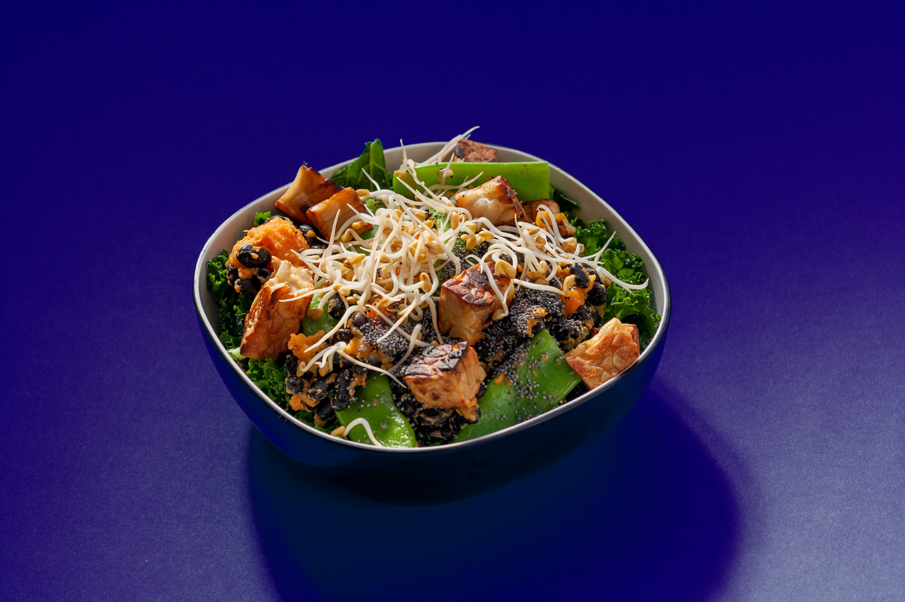

2022 is here! We have taken the time to look back and forward and we are very happy with our journey so far with Doming Club. Our [2021 review](2022-01-14.html) is available here.

In the new year, we want to continue our mission to build tools to fight the climate crisis through a better food consumption model. We want to continue to promote fermentation and tempeh as a sustainable food solution.

We aim to generate more interest and continue to work to reach a larger audience through communication, documentation and collaborations. We want you to project yourself into tempeh and fermentation so that afterwards you will be tempted to ferment your own tempeh. Because there is nothing better than homemade tempeh, the one you have seen grow and to which you have dedicated your time, care and kindness.

We are also currently designing and developing the Domingo Fermenter Mini, a version of our fermenter that we imagine in everyone's kitchen, to start fermenting tempeh, a natural source of plant protein, but also koji, the basis of miso, shōyu, amazake.

!!! notes ""
    In the meantime, we are facing a financial reality and we are currently looking for funding and partners to continue to work on our mission. Please [contact us](contact.html) if you have any ideas that can help us. We are also looking for points of sale for our Domingo Necklace and the upcoming Fermenter Mini!
