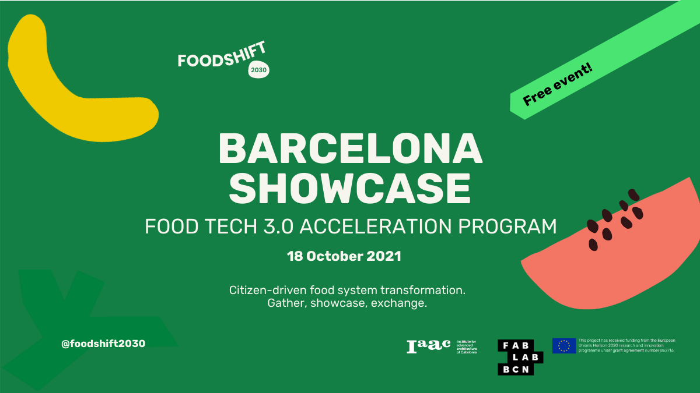

October is here! And it's late summer in Barcelona. We are still filled with the good inner energy of our 10 days walking on the Camino de Santiago and the good vibes of September.

With a deep desire to share our favourite plant-based protein product aka tempeh, we organised our first Tempeh Lunch in our studio, feeding a table of 20 curious bodies and minds. We would like to organise them every month, and even more for other special occasions. Stay tuned!

We will also start printing ceramic tests in [Afab Gracia](https://ajuntament.barcelona.cat/ateneusdefabricacio/en/gracia-fab-lab/) of the latest version of our tempeh mould. We are excited!

And last but not least, we are working hard for the last stretch before the [final event of Food Tech 3.0 Acceleration Program](https://foodshift2030.eu/events/). Indeed, we will end our 10-month journey by presenting the Domingo Club and the new version of our fermentation incubator. The event will take place during the Sustainable Food Week in Barcelona, the world capital of sustainable food 2021.

