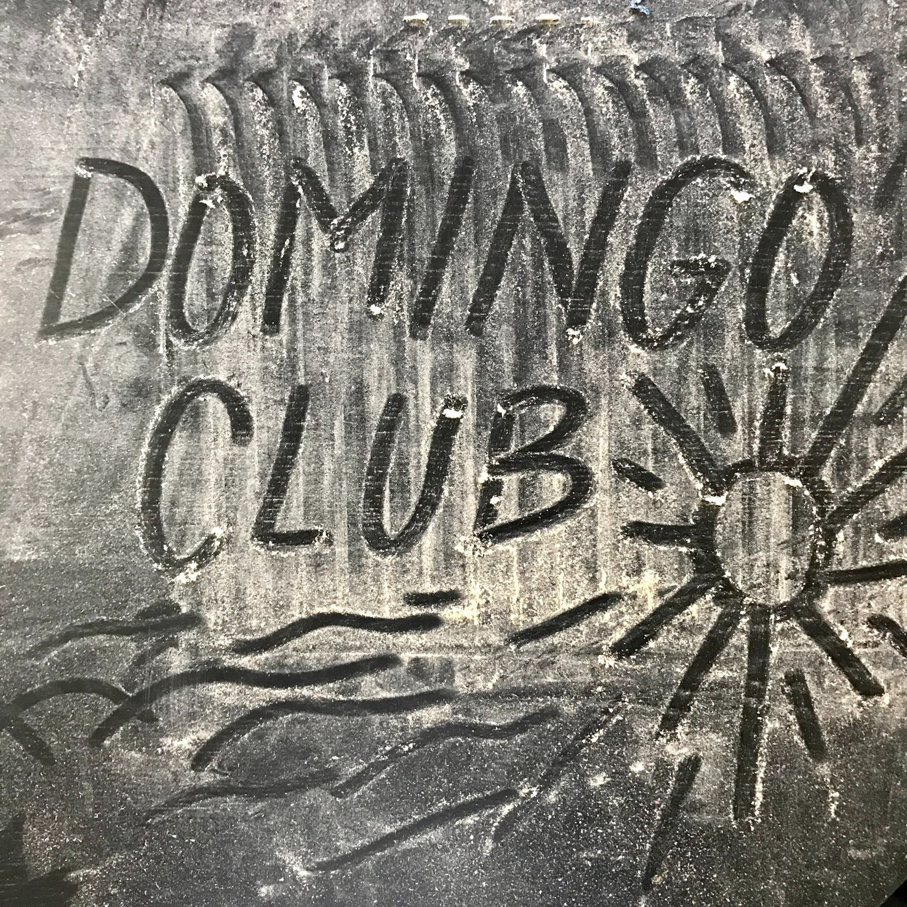

We are in the process of defining our project, and what a club means to us. What form can it take, how to welcome members, what would be our common goals?

Our first incubator prototype needs to be completed and documented, we are busy doing that. Looking for a natural food-safe coating for wood, finishing the shelves, refining the electronics, mastering the heating system.

We have started designing and 3D printing tempeh molds in PETG (a food grade plastic), but they are not as good as we would like. We are looking for better materials (in terms of durability and efficiency) to work with.

We have just moved to a new space, located in Poble Nou, Barcelona, Spain. We are in the process of setting up our local environment to accommodate people and workshops.

And finally, we continue to practice making tempeh, as we would like to get consistent results and delicious food :)

