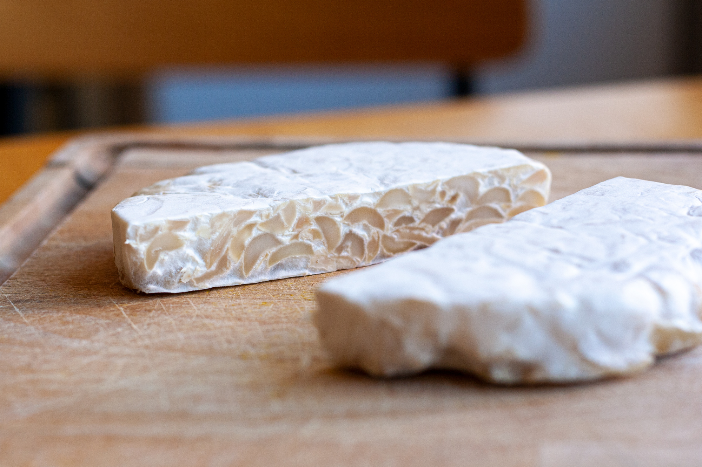

## Ingredients

For 2 people

- 100gr of peanut tempeh (which is equivalent to our round tempeh)
- 1 small onion
- 1 small sweet potato
- 1/2 cup of black beans
- 1 handful of flat beans
- 1 handful of kale
- 1 clove of garlic
- 1 inch of ginger
- 1 inch of turmeric
- a drop of soy sauce
- a drop of poppy seed
- some fennugreek sprouts

## Method

0. If your black beans are dry, soak them the day before in water
1. Boil your black beans until they are cooked and set aside
2. Cut the sweet potato and the flat beans in pieces of your choice and cook them in water, set aside
3. Select pieces of kale leaves in a bowl, add a drizzle of olive oil and massage them with your hands, set aside
4. Cut the tempeh in cubes and fry them over a gentle heat in a pan with virgin olive oil until golden, set aside
5. Shop the onion, the ginger and the turmeric and fry them for few minutes over a gentle heat with virgin olive oil
6. When cooked, add the sweet potato pieces and flat beans to the onion, ginger and turmeric. Let fry for a few minutes
7. Shop the garlic and add it fresh to the mixture. Garlic does not need to be cooked, it keeps its properties better when it's fresh
8. Dress everything in a bowl
9. Season with a dash of soy sauce, a few poppy seeds and the fennugreek sprouts
10. Enjoy!

