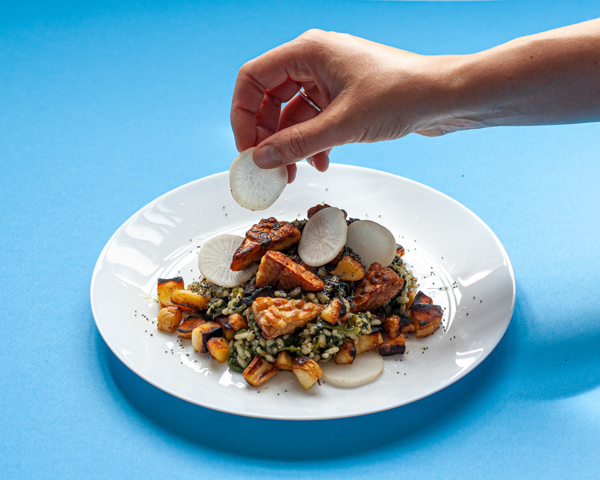
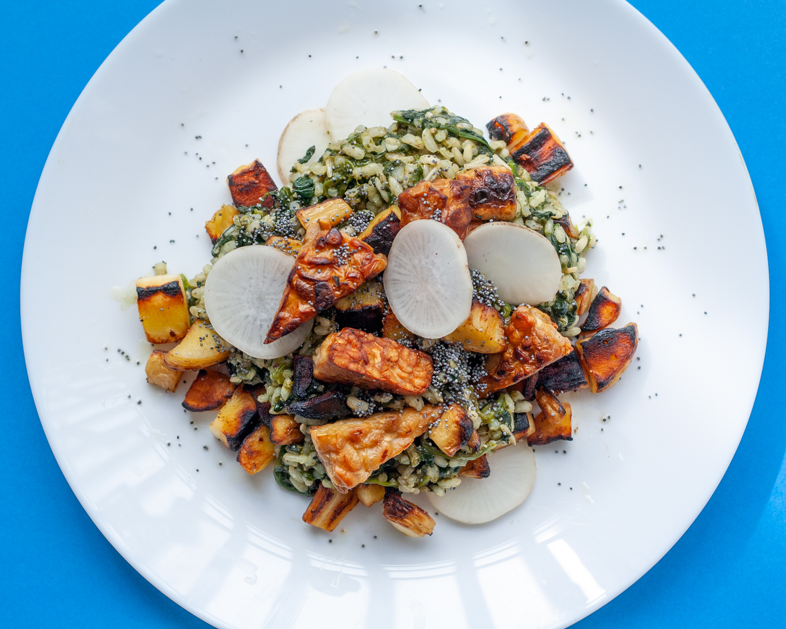

## Ingredients

For 2 people

- 100gr of soy tempeh (which is equivalent to our round tempeh)
- a cup of rice
- 2 large handfuls of fresh spinach
- 2 parsnips
- 1/4 daikon
- a clove of garlic
- the juice of 1/2 lemon
- salt, to taste

## Method

1. In a pot, cook your rice in twice its volume of water with the fresh spinach
2. Dice your tempeh and parsnips and fry them in a pan with oil
3. Chop your garlic and add it to the rice and spinach when cooked
4. Also add lemon juice and a little salt
5. Cut your daikon into thin slices for dressing
6. Arrange everything in a plate. Add some seeds if you have
7. Enjoy!

