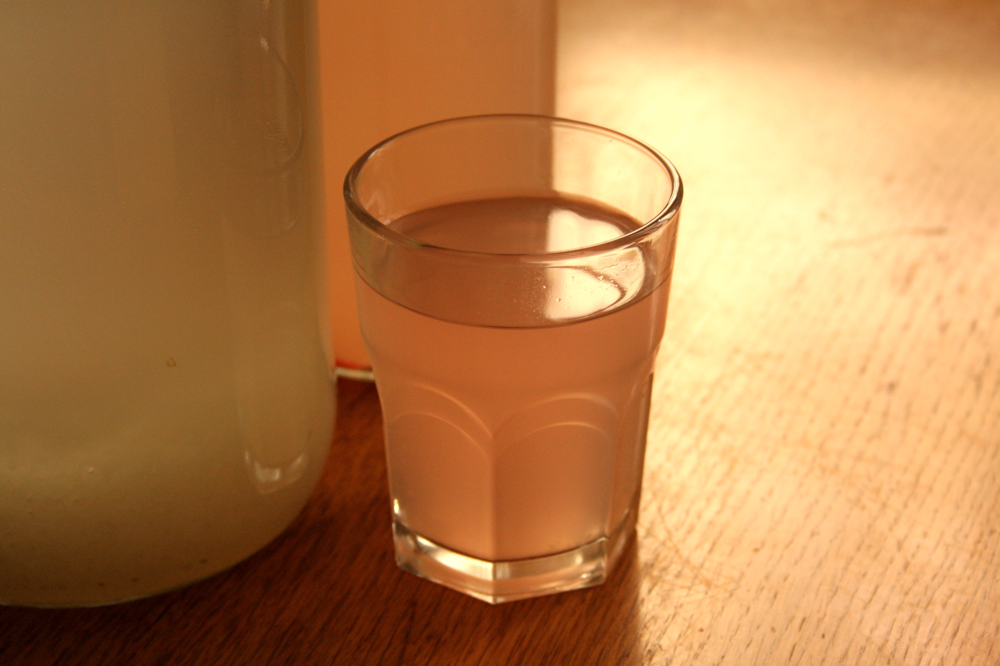
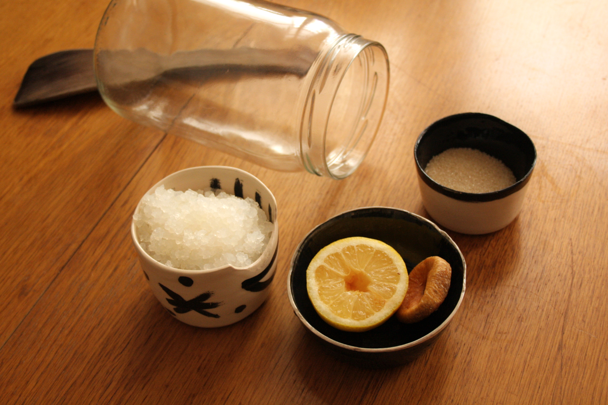
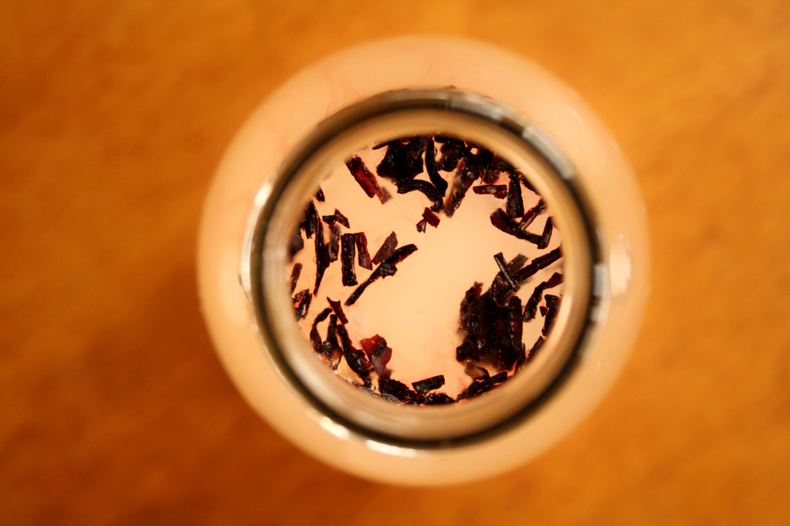
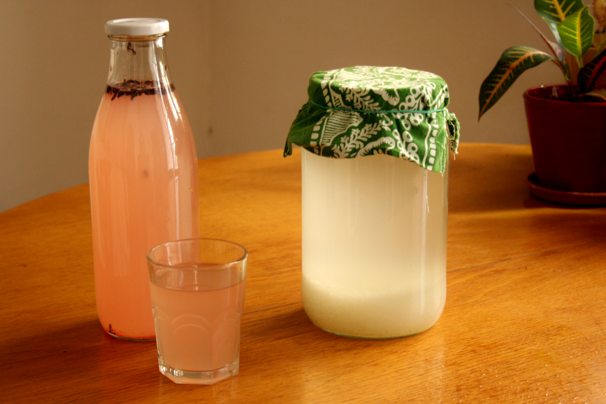
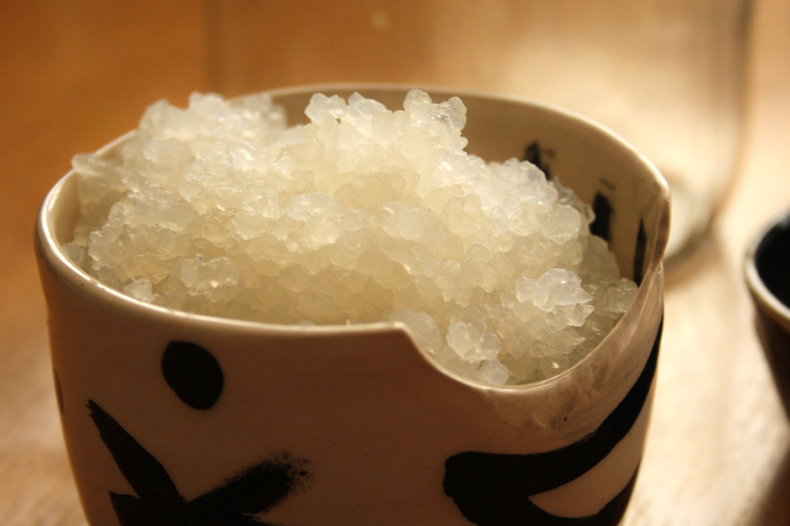

# What is it?

Water kefir is an ancient fermented carbonated drink made from water kefir grains. Unlike ordinary kefir, which is made from milk, water kefir is made by combining sugar water with water kefir grains — a culture of bacteria and yeast.

The mixture ferments for ~36 hours, producing a probiotic drink rich in beneficial bacteria. This drink is refreshing, easy to enjoy and full of health benefits. We love it and drink it every day throughout the year.

# What do we need to make it?

## Ingredients (for 2 liters)

- 6 tablespoon of Water kefir grains
- 2 liters of water
- ​3 tablespoon of sugar
- 1 dried fig
- Juice of half an organic lemon

## Material

- A glass jar
- A wooden spoon
- A plastic strainer

!!! notes "Why can't I use metal utensils?"
    Exposure to metal can weaken the kefir grains. Indeed, kefir, being acidic, undergoes a modification of its structure in contact with aluminum, iron or copper. Stainless steel can be used without any problem.

# how to make it?

The following process takes from 24 to 48h depending on your taste. The first fermentation produces the natural kefir, the second one brings the flavours and the fizz.

## First fermentation

- Add kefir grains, water and sugar to the jar
- Stir to dissolve the sugar
- Add the lemon juice and the fig
- Let ferment at room temperature for 24 hours
- Strain the water kefir into a glass bottle and reserve the grains for later (see below)

!!! notes "How can I tell if the first fermentation is done?"
    The kefir is ready when the dried fig has risen to the surface (it acts as an indicator)  and there are more and more bubbles.

  
## Second fermentation

After the first fermentation comes the time to add fizz and flavor to the kefir. We like to use mint leaves, ibiscus flowers, rosemary sprigs, apple and pear slices, hot pepper (so good!), or anything else that can enhance our daily drink.

- Add the flavoring to the strained kefir
- After ~24 hours, filter the kefir again to prevent the added flavor from being too strong and place the bottle in the fridge
  

!!! notes "When can I drink my kefir?"
    You can drink it straight away! However, we prefer it cold, so we put it in the fridge for a few hours days before drinking it, or we serve it on the rocks.

# What to do with the grains?

## Make another kefir

We usually start a new kefir right after the first fermentation, with the freshly filtered grains. This allows us to have this delicious beverage always available in our fridge.

## Conserve the grains for later

If you want to take a break from making kefir, you can store your grains in sugar water in the fridge for up to two weeks.

The grains feed on sugar and the cold of the fridge slows down their growth, and therefore their appetite.

## Spread your practice

The grains grow day by day until they break into smaller pieces, so that they become more and more numerous. Soon the time comes when you have too much grain for your own use.

The best thing to do when you have too much grain is to share your fermenting practice with the rest of the world by giving away your extra grain to your friends and family.

## Don't waste bacteria

In addition, you can also use the kefir grains in your compost, they are good bacteria for the decomposition process.

