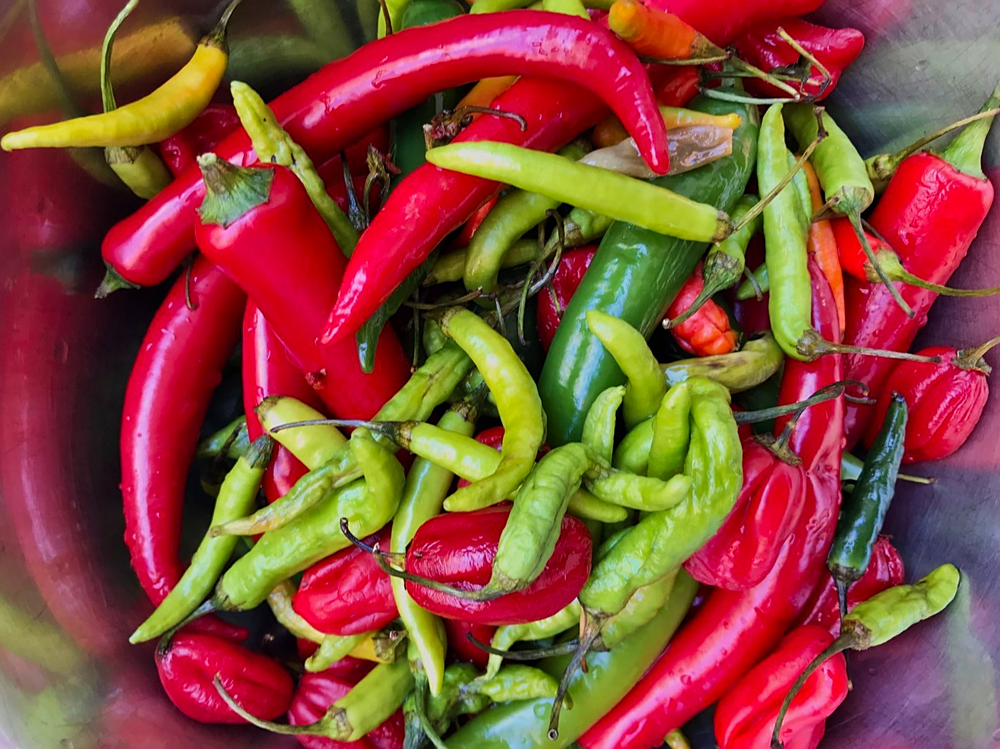
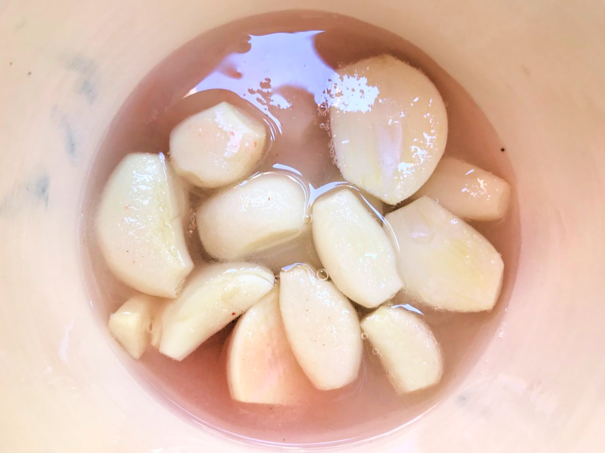

# What is it?

Sriracha sauce is a type of fermented hot sauce originated from Thailand made from a paste of chili peppers, distilled vinegar, garlic, sugar, and salt.

# What do we need to make it?

## Ingredients (for ~30cl of sriracha sauce)

### first step

- 600g of various peppers (such as 300g red jalapenos, 200g red Thai pepper, 100g Scotch Bonnets)
- 6 garlic cloves
- 45g of sugar
- 1 tablespoon of salt
- 12cl of water

### second step

- 12cl of rice vinegar

## Material

- a blender
- a container with a clean piece of cloth as a lid
- a rubber band or a string

# How to make it?

### Preparation

- First, wash your glass jar with dish soap and let it dry
- Then, wash the peppers and remove the stems
- Blend them with the garlic, sugar, salt and water to make a smooth paste

!!! notes "Caution, do not put the vinegar yet!"
    The vinegar is needed in the second step of the recipe, when the fermentation is done. The vinegar will help to preserve the sauce over time. If you add the vinegar now, you'll damage the fermentation process of the sauce.

- Put the paste in your clean jar and cover the jar with a clean piece of cloth and a rubber band

### Fermentation

- Place the jar on a plate in case the mixture "rots" and overflows.
- Let the mixture ferment for ~5 days at room temperature.

!!! notes "Keep an eye on it!"
    It is recommended to stir the mixture with a clean spoon every day so that the pulp and liquid come together.

### After ~5 days

- Blend the mixture again, adding the vinegar. Mix well.
- Strain the mixture into a saucepan with the back of a spoon over a sieve to obtain a super smooth sauce without pulp

!!! notes "Tip: the pulp can be saved to make chilli oil!"
    Simply save the pulp in a clean jar and cover with olive oil. After a few days, the oil will take on the flavour of the pulp. Keep it out of the fridge as long as you wish.

- Simmer the sauce on medium/low heat for 30 min, until the sauce thickens.
- If foam appears, carefully remove it.
- Remove the sriracha from the heat and let it cool to room temperature

# Storage

- Bottle it and place in the refrigerator.
- It will keep for several months.

