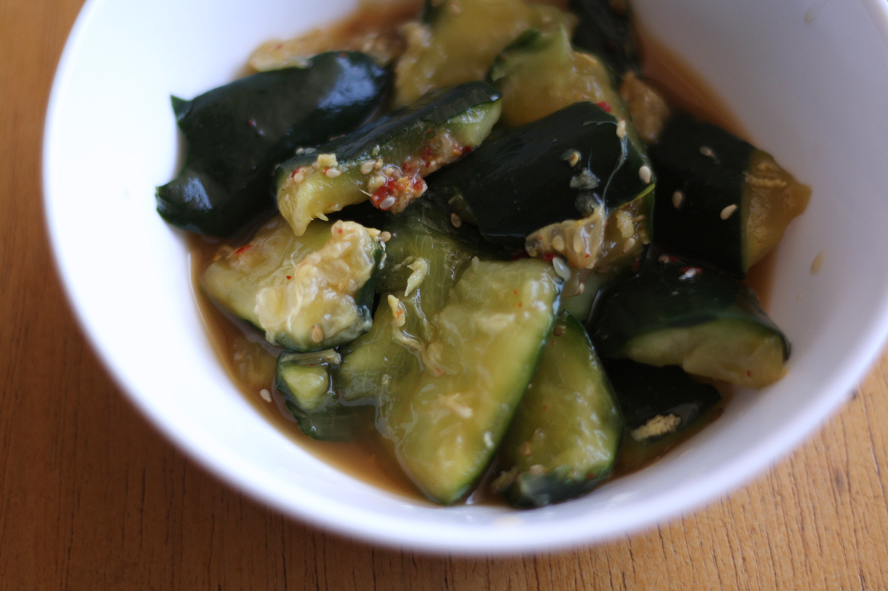
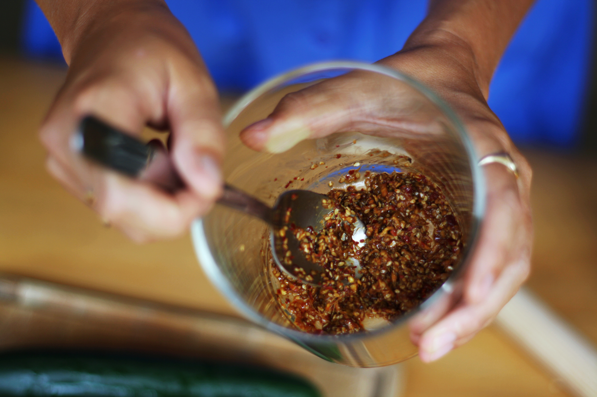
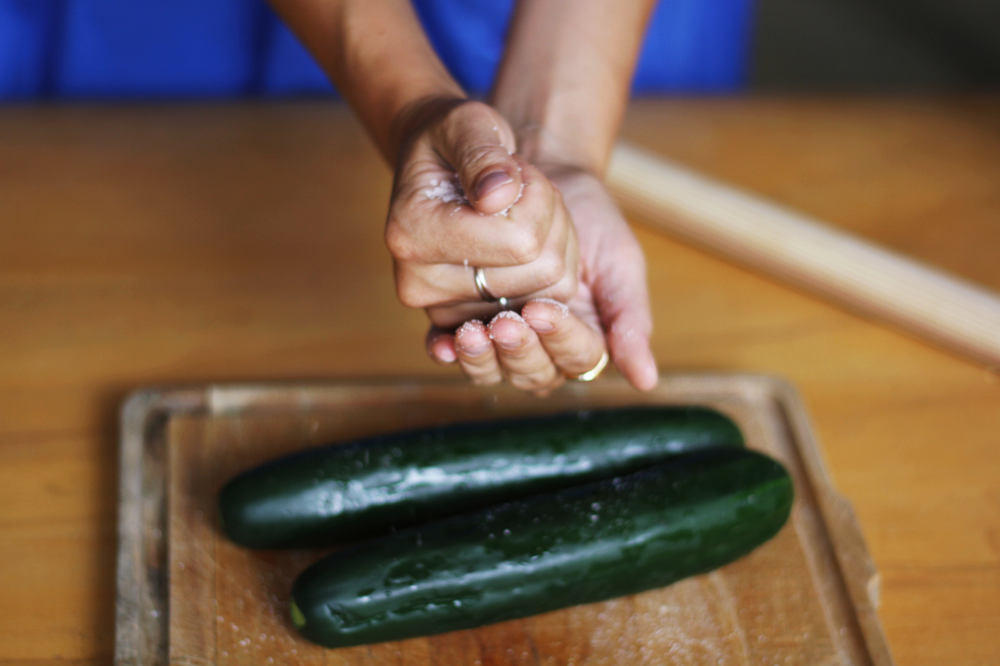
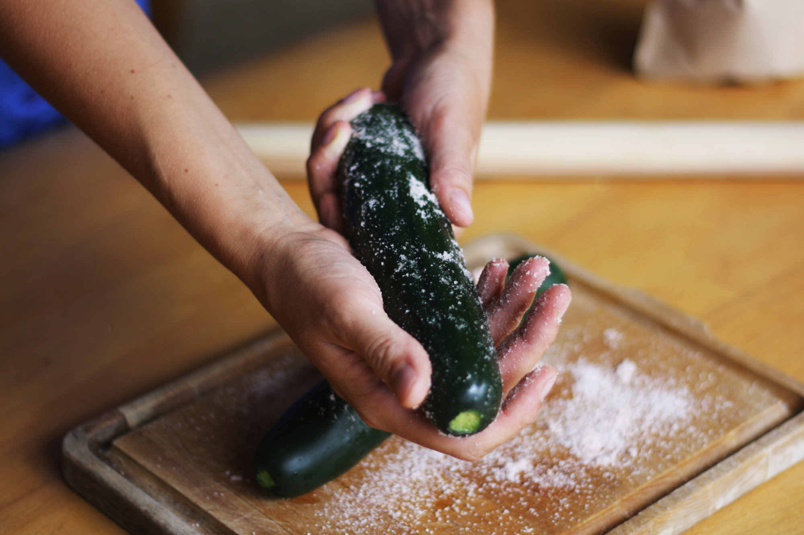
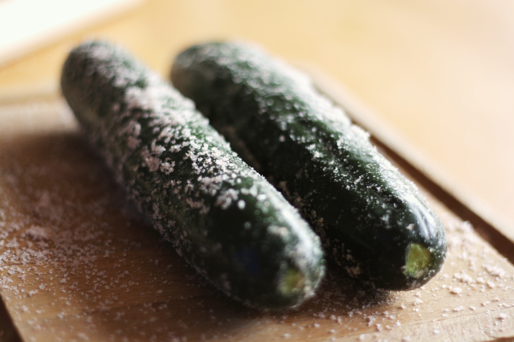
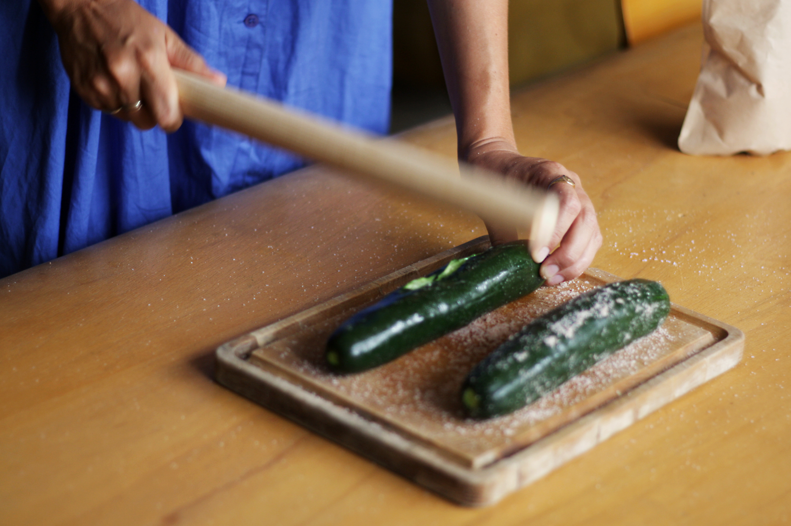
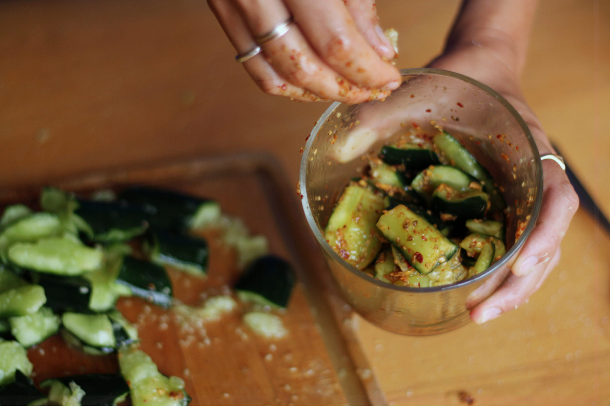
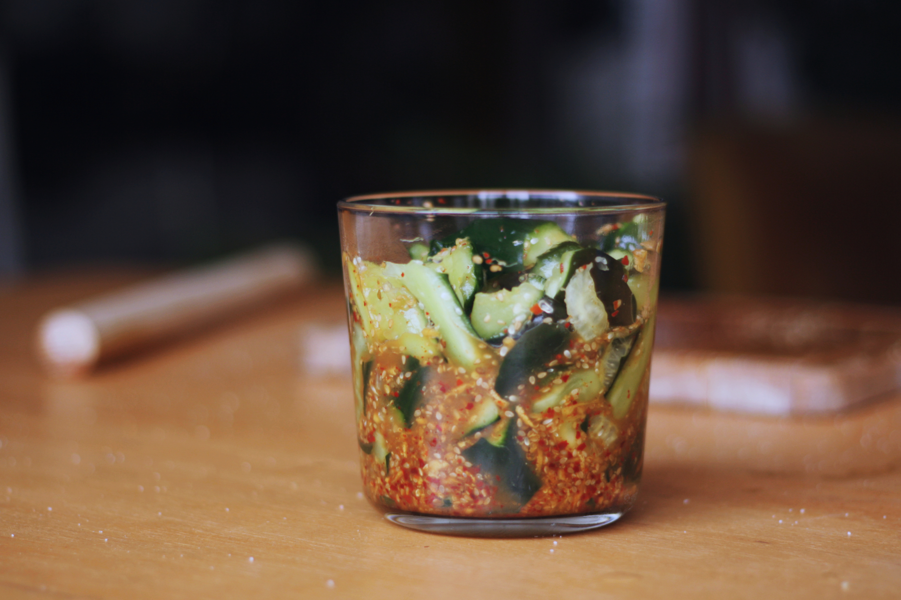
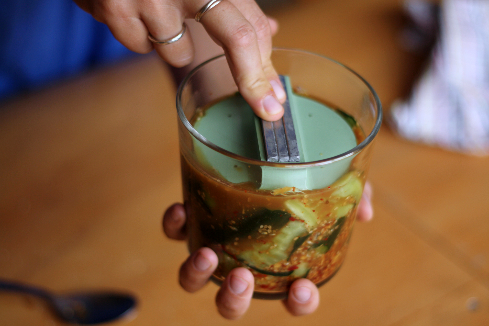
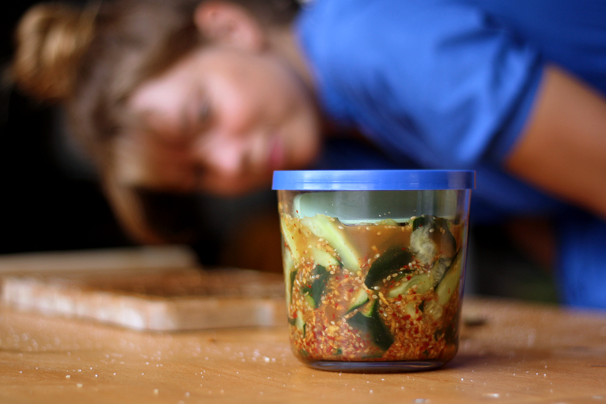

# What is it?

Yes, you will have to beat the cucumber. Because beating the cucumber into pieces gives you nice jagged shapes and also crushes the cell structure so the vegetable releases moisture more quickly.

# What you need to make it?

## Ingredients

### Main

- 2 cucumbers
- seasalt (2% of the vegetable weight)

### For the marinade

- 6cm of ginger
- 2 dried chilipeper
- 1 tablespoon of toasted sesame seeds
- 2 tablespoon of soy sauce
- 1 tablespoon of vinegar
- 1 teaspoon of apple syrup

## Material

- a rolling pin
- a container and a [press lid](press-lid.html)

# How to make it?

## Marinade

- Grate the ginger and finely chop the chilli
- In a small saucepan, bring the sesame seeds, soy sauce, vinegar, apple syrup, ginger and chilli to the boil
- Let cool to room temperature

## Smash the cucumber

- Remove the stem of the cucumber
- Put some salt in the palm of your hand and rub the cucumber vigorously with the salt. The skin becomes porous and the cucumber immediately begins to ooze moisture
- Place the cucumber on a cutting board and compassionately beat it into irregular pieces with the rolling pin
- Break the flesh into small pieces with your hands

## Pickle press

- Put the cucumber pieces in your container and mix them with your hands into the marinade
- Put the press lid on top and push it lightly
- Let pickle at room temperature for 1 hours

](smashed-cucumber-10.jpg)

!!! notes "What's the press lid for?"
    The pressure on salty food accelerates the chemical and physical transformation process of vegetables. What this does is collapse the cell walls of the vegetable, releasing the moisture and concentrating the flavor. So adding some pressure to the veggies helps the salt do its work.

    👀 Find out more about our 3D printed [press lid](press-lid.html)

# Storage

You can keep it in the fridge for up to 2-3 days.
