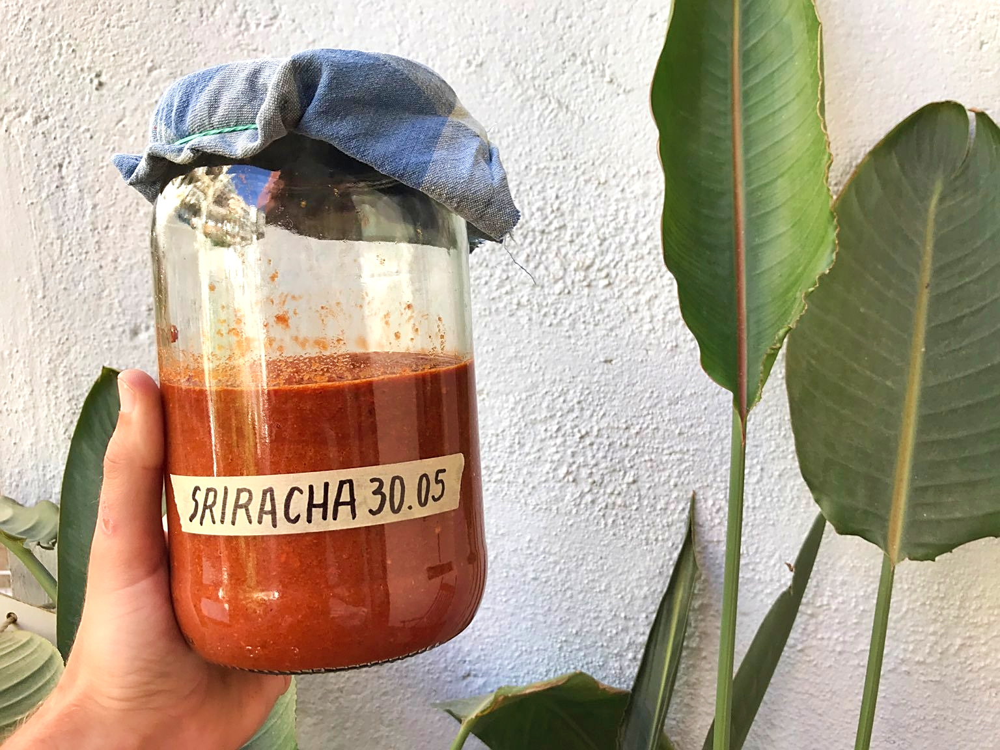

This morning I came back from the local fruit and vegetable shop with a ton of chillies, with the idea of making a new sriracha sauce (a fermented chilli sauce from Thailand). This sauce never lasts long in our house, we eat it with just about everything.

!!! note "The recipe is coming"
    We'll write our recipe as soon as we finish this batch.

The recipe is composed of two steps with a fermentation time in between, which makes it quite quick and easy to make for an excellent and very spicy result.

<!-- [🔥 Sriracha sauce recipe 🔥](button:sriracha.html) -->

— Toni