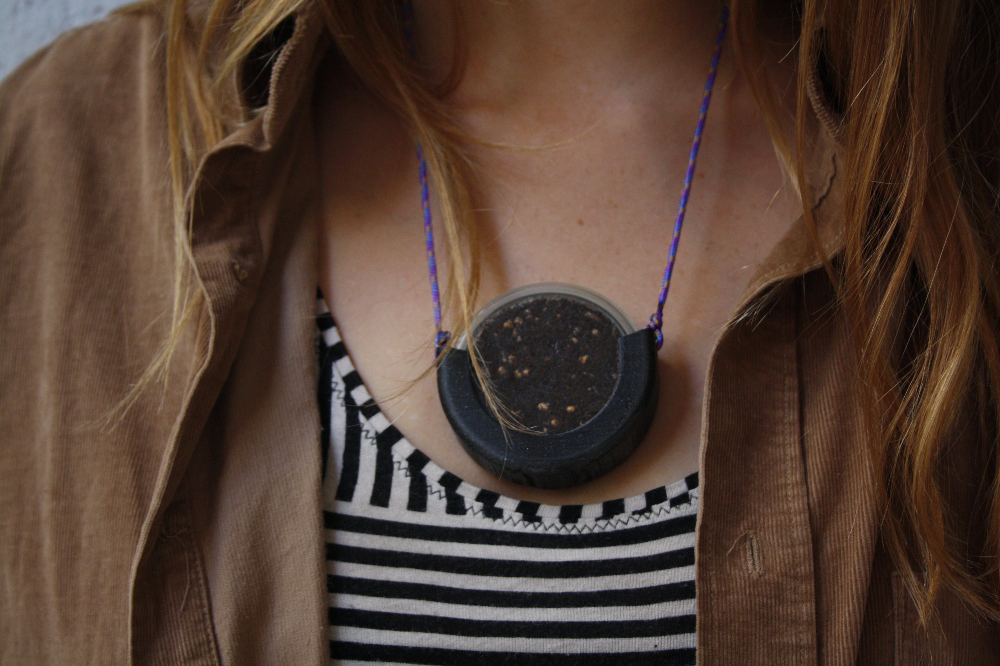
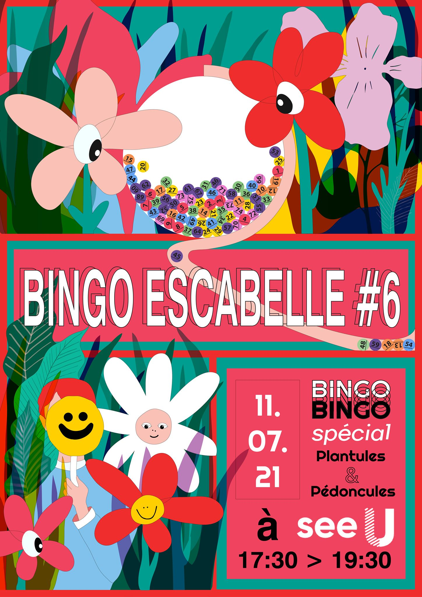

We sent a prototype version of our Incubator Necklace to [See U Brussels](https://www.see-u.brussels/) in the context of their *Bingo Escabelle* which took place on Sunday 11th July.

!!! notes "What is an Incubator Necklace?"
    Our incubator necklace is a playful invitation to observe and understand the collaboration with natural processes. Visit the [[incubator-necklace]] page to discover it.

*Bingo Escabelle* put the spotlight on engaged Brussels projects and collectives by presenting their creative work during a fun and convivial moment.

We are looking forward to finding out who won this prize and became the new owner of this micro pet! Send us pictures 👀

