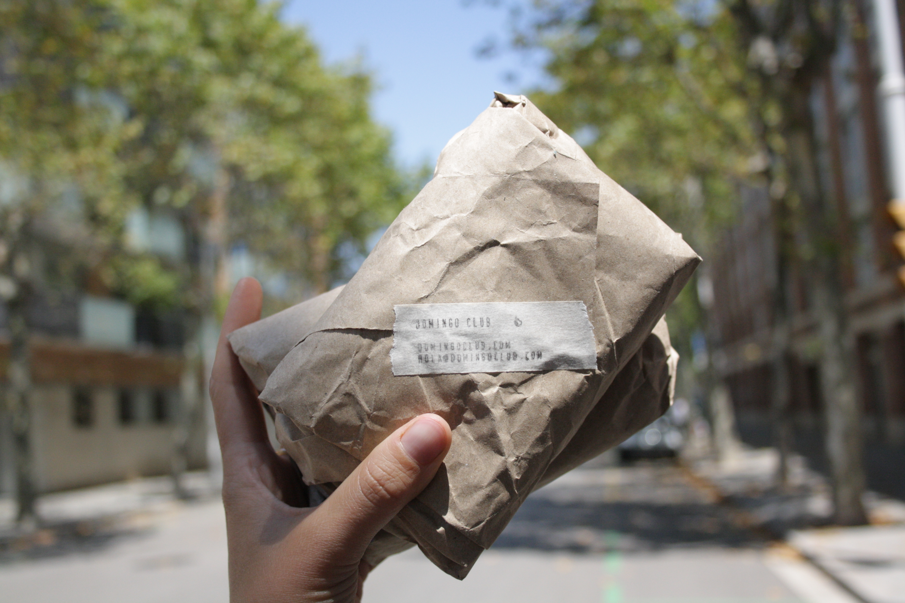

Back to the post office today, but this time bound for Amsterdam.

Indeed, in the context of the [Hyper Global / Hyper Local exchange programme](https://makersxchange.eu/), we are teaming up with Valentina from [My Vegan Fam](https://www.myveganfam.com/) to improve our [[tempeh-moulds]].

!!! notes "Let us introduce her"
    Valentina is a professional tempeh maker based in Amsterdam. She has a burning passion for tempeh and that pushes her to get out and spread the love for this fantastic food. She is the one who gave us her tempeh recipe when we were in Amsterdam two years ago.

She will test our moulds and give us feedback, we will then co-design the next version and finally, we will support her to 3D print the new version in a local makerspace in order to test the distributed design and decentralised fabrication side of the project. We'll keep you posted!
