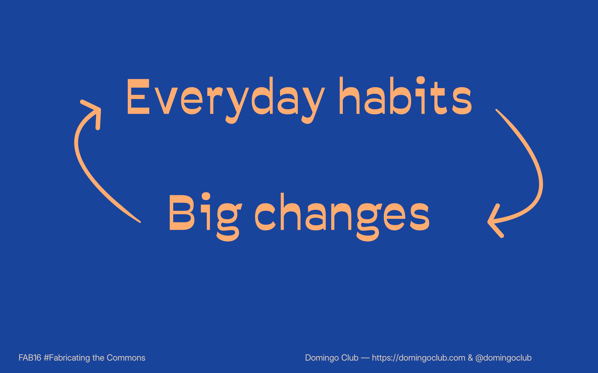
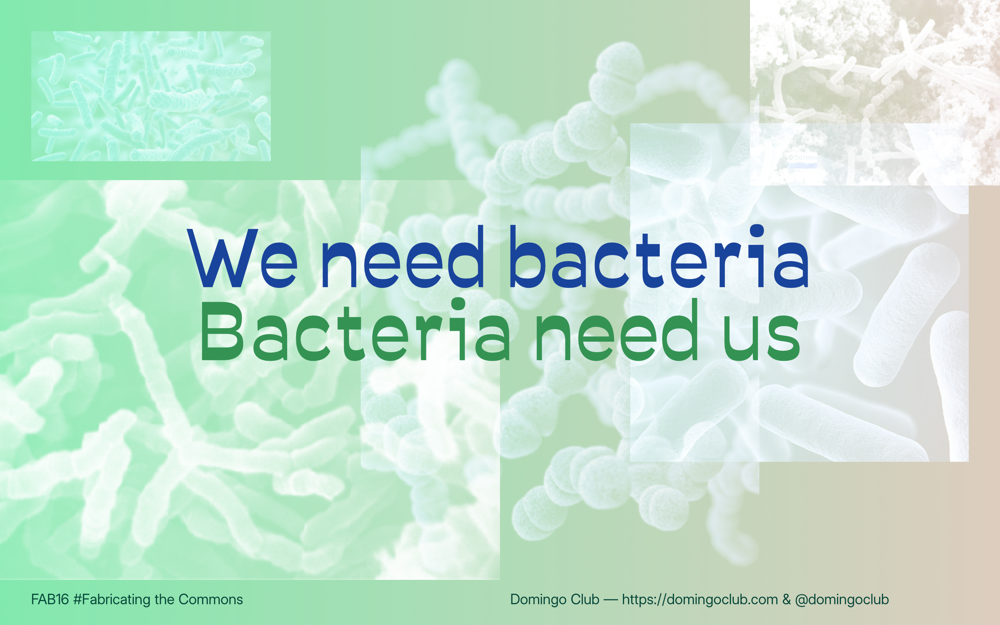
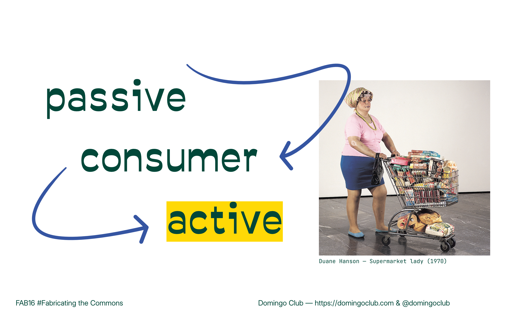

This morning we had the chance to present our open-source incubator at the [Fab16](https://fab16.org/), the worldwide event of the Fablab network! We gave a talk, or theory workshop as they call it, for the first time and we really enjoyed doing it.

We covered topics such as:

- fermentation as a process of partnering with microorganisms
- plant-based proteins as an effective solution for reducing greenhouse gas emissions
- how to make tempeh
- why we make open source tools
- how to leverage the principles of distributed design and decentralised manufacturing

Thank you all for coming and we hope to share the recording soon for those interested who missed it :-)

!!! notes "FAB16 event"
        FAB16 brings together members of the international Fab Lab network, as well as government officials, academic researchers, and experts in the field of digital fabrication, to present, envision, discuss, and build community around digital fabrication, technology, and innovation. This year, FAB16 and Fab City Summit will all be hosted online, with FAB16 Hubs creating events for their communities to join the online programming and local programming of their own. 

