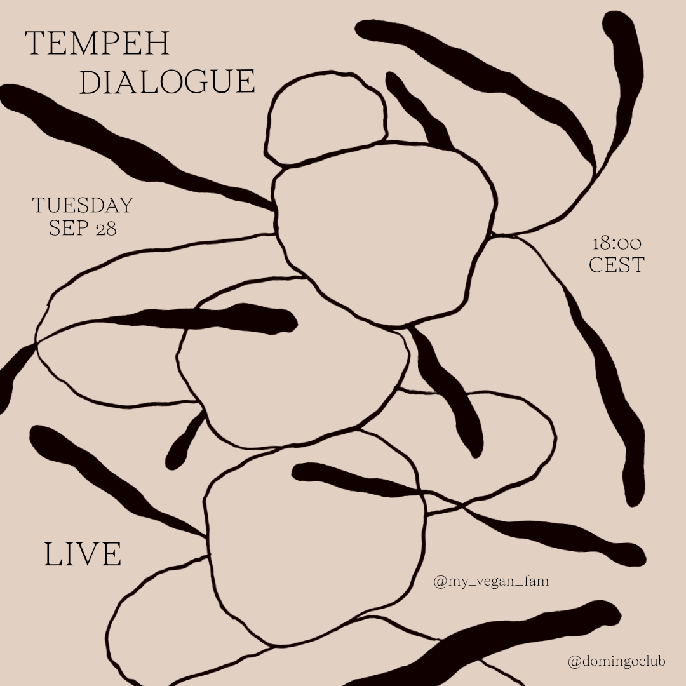

To close our [Hyper Global / Hyper Local exchange programme](https://makersxchange.eu/), we were live on Instagram with Valentina of [My Vegan Fam](https://www.myveganfam.com/).

We presented our collaboration about the design and fabrication process of our tempeh moulds. She first tested our moulds and give us feedback, we then co-designed the next version and finally, we supported her to 3D print the new version in a local makerspace [Waag](http://fablab.waag.org/) (thank you!) in order to test the distributed design and decentralised fabrication side of the project.

The [new version](3D-printed-moulds-v-02.html) of the 3D printed tempeh mould is then available on our website 🌞 Please use, modify and share!

