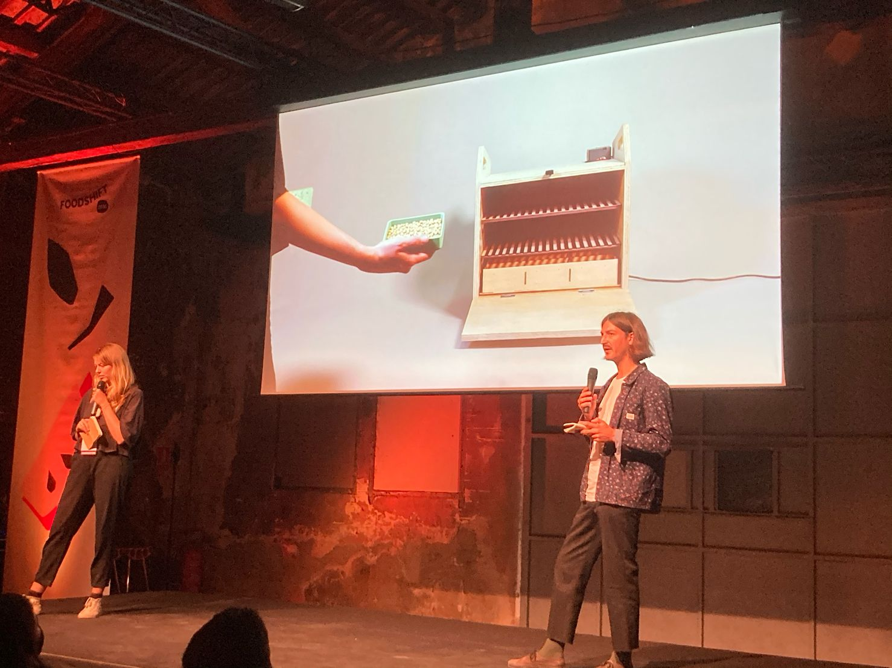

We presented the work we have been doing over the last few months as part of our Food Tech 3.0 journey, a 8-month acceleration programme run by [Fab Lab Barcelona](https://fablabbcn.org/) and [FoodSHIFT 2030](https://foodshift2030.eu/)

Together with 9 other innovators, we explained our project in a petcha-kucha format and in an interactive stand. You can watch the whole conference [here](https://www.youtube.com/watch?v=z3pjBQ_xCbo), or go to 7:09:05 to see us!

This event was part of the Sustainable Food Week of Barcelona, the World Sustainable Food Capital 2021.

