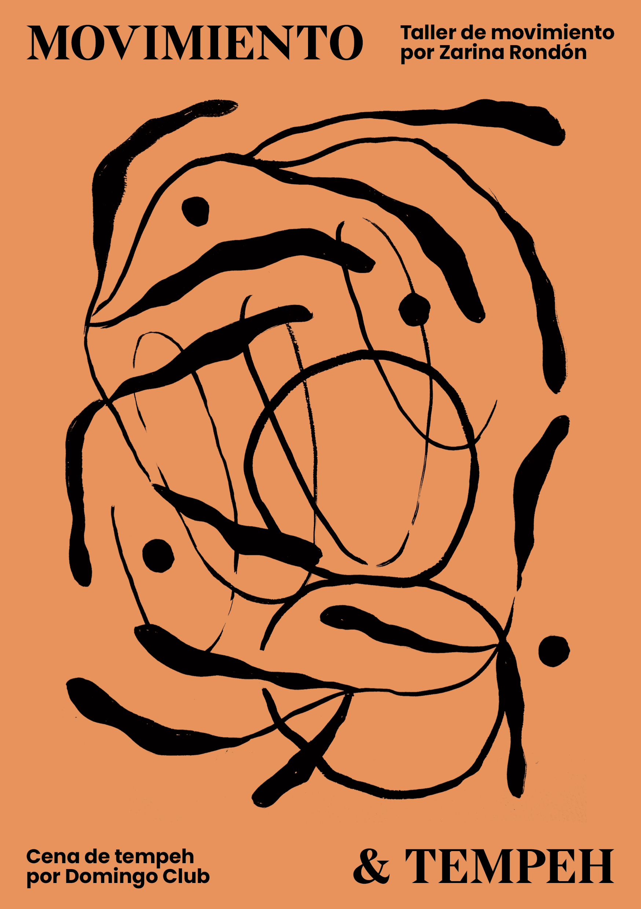

We have proposed an event that nourishes the body, mind and soul through corporal movement and sustainable food in collaboration with our friend and dancer Zarina Rondón.

It started with a 2 hour session of the movement workshop given by Zarina Rondón where movement was explored with exercises that open the doors of observation to detail our ability to dance, move and exercise with flexibility (mental and physical).

Afterwards, we gathered around a shared meal where we introduced the world of fermentation and fungi with tempeh. We offered a 100% vegan dish, in which tempeh shone on its own and was combined with seasonal vegetables and condiments.

<iframe src='https://player.vimeo.com/video/648988145' frameborder='0' webkitAllowFullScreen mozallowfullscreen allowFullScreen></iframe>

<iframe src='https://player.vimeo.com/video/648988016' frameborder='0' webkitAllowFullScreen mozallowfullscreen allowFullScreen></iframe>

Images shot by Benjamin Scott on the roof of our studio in Poblenou (Barcelona, Spain) and edited by Zarina Rondón. Movements by Zarina Rondón, Pilar Rodriguez Catón y Gabriela Lotaif. Tempeh Necklace by Domingo Club.
