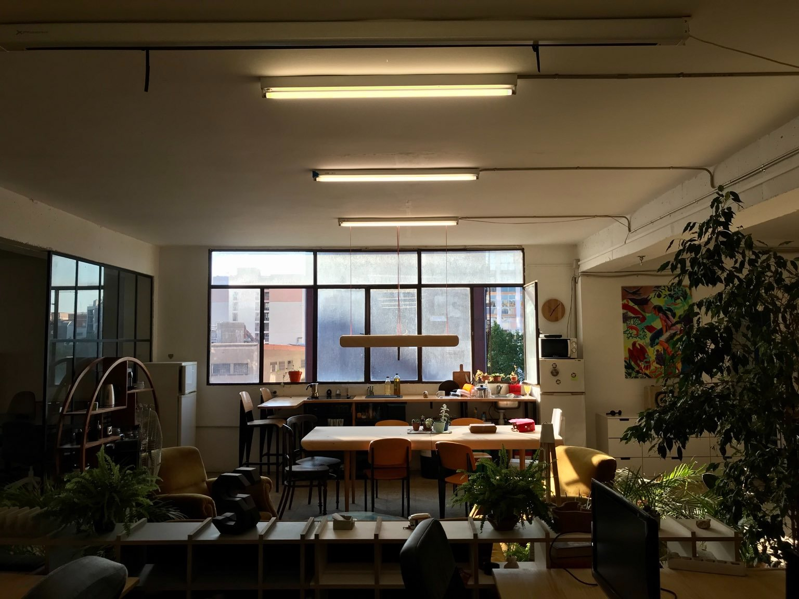
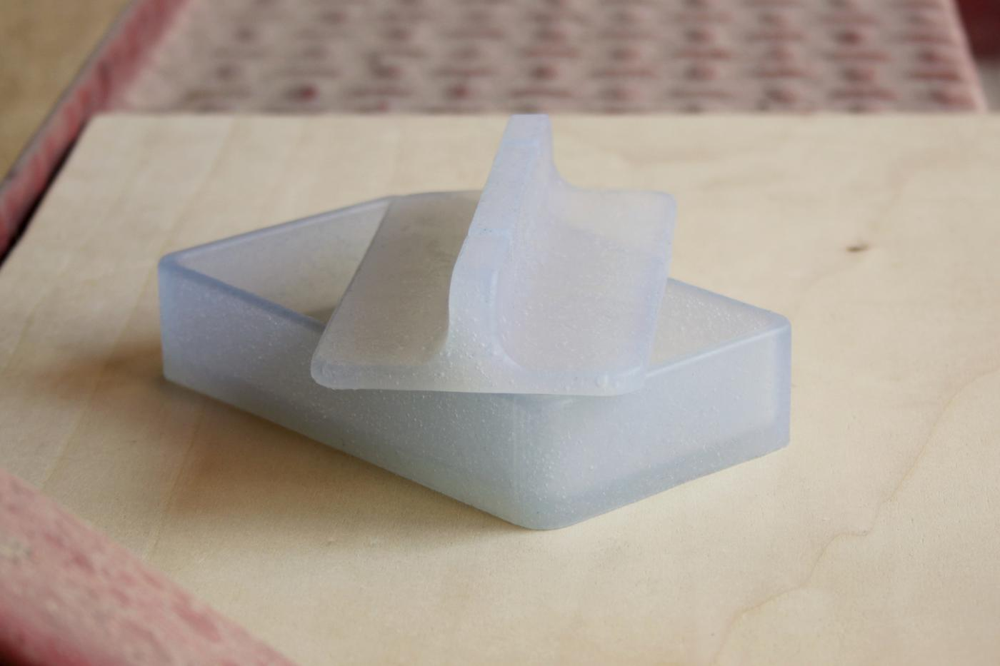
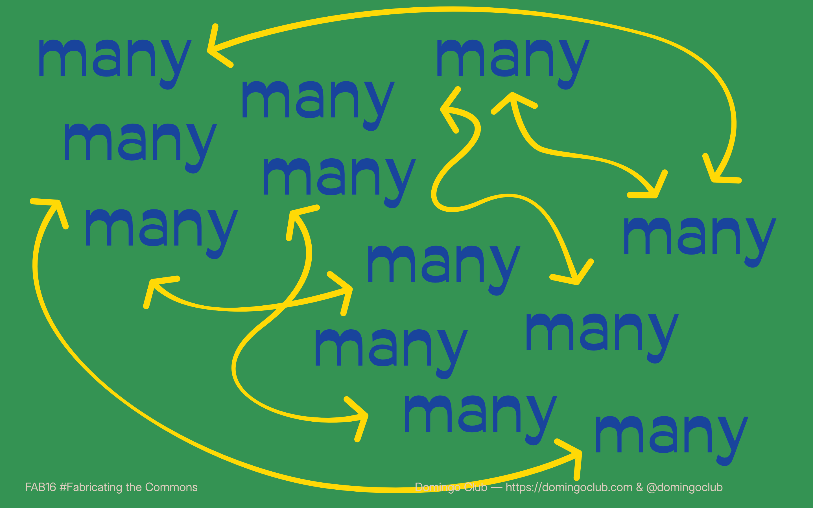
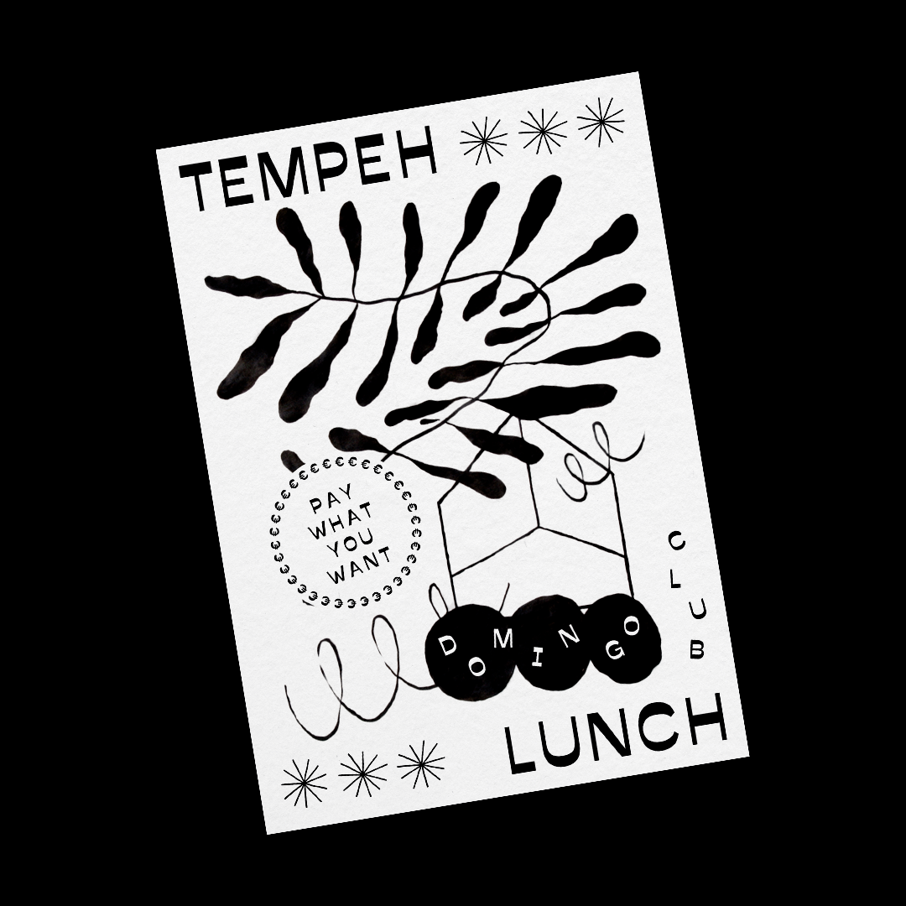
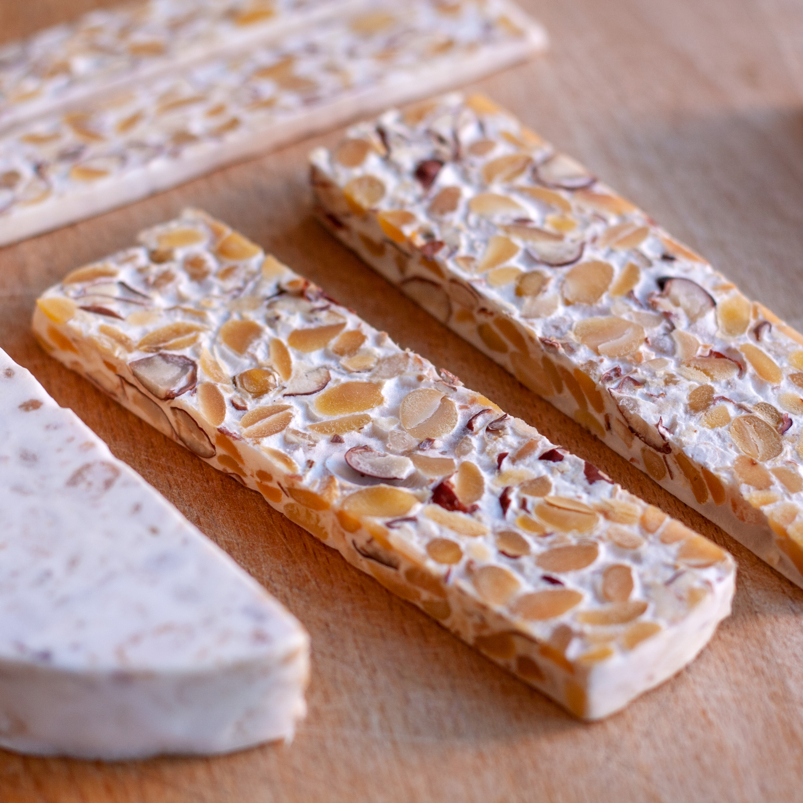
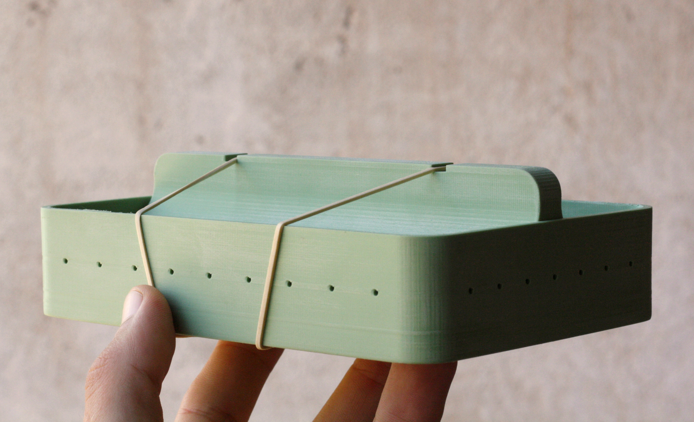
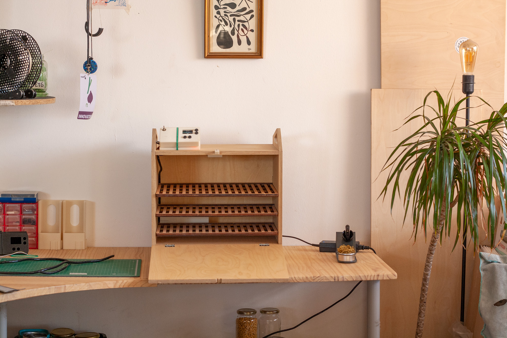
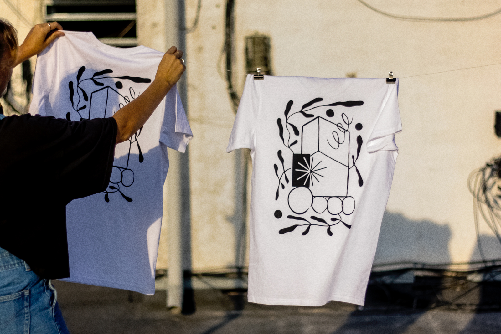
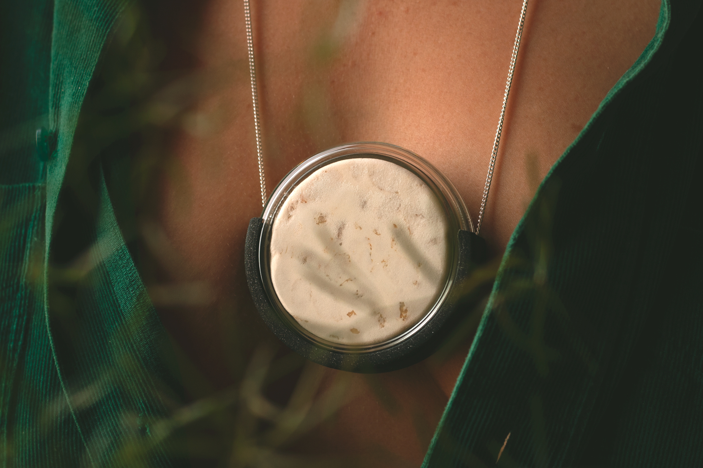
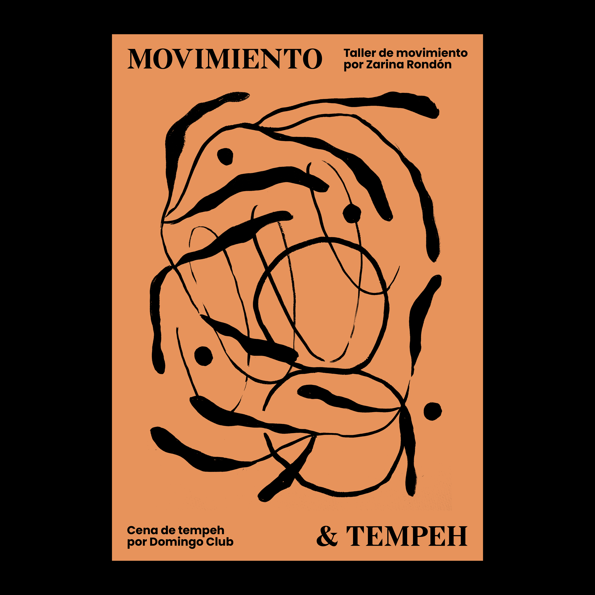

Hello friends,

It's been almost a year since we decided to fully dedicate ourselves to the Domingo Club and our mission to promote plant-based food, the practice of fermentation, interest in mushrooms, and making tools for anyone to start fermenting their food at home, teaming up with bacteria and fungi.

Let's review 2021 with the main events of our year.

# ☼ March

Official launch of Domingo Club.

Our proposal was selected for **Fab Lab Barcelona's Food Tech 3.0** accelerator program and we decided to go all in. We went from side projects related to our personal fermentation practice to a design studio focused on sustainable food and tools for everyone to ferment at home.

We launched our website to document our daily practice and our Instagram page to reflect these changes to a growing audience.

# ☼ April

We moved our 3D printer, wooden boards, electronic components, and boxes filled with a myriad of prototyping materials from our apartment to a space in the **urban design district of Poblenou in Barcelona**. Once an industrial area, it began a process of transformation and regeneration in the late 1990s and is now home to entrepreneurial hubs. We have a studio!

# ☼ May

In order to stop the use of single-use plastic bags for tempeh production, we designed 3D printed tempeh moulds.

We entered our 3D printed tempeh moulds in an **innovation challenge organised by WikiFactory** and won the prize for best functionality. The judges said *"Clever, simple, insightful and functional. Really the best design for easy manufacturability"*.

# ☼ June

Domingo Club was selected and presented in the **London Design Biennale**'s "Design in Age of Crisis" exhibition. We proposed the idea of a BioLab kitchen, a kind of facility that anyone can easily build and use at home to reimagine all aspects of food, waste and living systems. Our proposal was to move from an extractive to a regenerative economy, observing and understanding natural systems for more synergies.

We were selected to be part of the innovative proteins cohort of the **Food System Game Changers Lab** acceleration program run by EAT, IDEO, Thought For Food, The Rockefeller Foundation, Forum for the Future, Meridian Institute, SecondMuse and Intention 2 Impact. We have discussed and researched with other initiatives that are having a positive impact on the global food system.

**Makery** (media for labs) came to interview us in our studio about our practice and projects. The transcript is online on their website.

# ☼ July

Our tempeh incubator won the **Distributed Design Excellence Award 2021**, tackling all four core principles of the distributed design model: Open, Ecosystemic, Sustainable and Supportive! The Distributed Design Awards celebrate the best maker and design responses to the post-industrial design paradigm. These awards recognize the most innovative, supportive and sustainably designed projects across Europe.

We started a collaboration with Valentina from MyVeganFam as part of **Hyper Global Hyper Local**, a European maker exchange. Valentina is a professional tempeh maker based in Amsterdam. She gave us excellent feedback on our tempeh making tools, which gave us a better understanding of the practice from an experienced practitioner's perspective.

# ☼ August

We presented our open-source incubator remotely at the **FAB16 Montreal**, the worldwide event of the Fablab network. We gave a talk for the first time and we really enjoyed doing it. We covered topics such as: fermentation as a process of partnering with microorganisms; plant-based proteins as an effective solution for reducing greenhouse gas emissions; how to make tempeh; why we make open source tools; how to leverage the principles of distributed design and decentralised fabrication.

# ☼ September

We started our **Tempeh Lunch** series in our studio. Our Tempeh Lunch is a convivial moment where we cook a delicious tempeh dish and share it with friends and friends of friends. It's great to see people discovering tempeh and loving it. Everything is vegan, local and organic and based on a pay-what-you-want system.

We hosted an online event called **Tempeh Dialogue** with Valentina from MyVeganFam to publicly discuss our maker exchange on tempeh making tools, and answer questions from enthusiasts. It was great to connect with the fermenter community.

# ☼ October

We participated in the **Food Tech 3.0 Showcase**. This was the closing event of the Food Tech 3.0 accelerator programme we have been participating in for the past six months. We took part in sessions with other (low) food tech related projects on alternative business systems, building community, using digital fabrication to prototype and bring our ideas to life. We showcased a new prototype of our tempeh incubator/fermenter and presented our overall Domingo Club project in a pecha-kucha format to a very enthusiastic audience.

**We launched our e-shop** with organic cotton tee-shirts designed by us and screen printed locally in Barcelona. This is a good way for people to support our project until our tools are ready (and a good excuse for Toni to get back to his drawing practice).

Release of the **Distributed Design Book** featured one of our articles. We wrote about our Domingo Club project, our vision and our values.

# ☼ November

Release of our first product, after the tee-shirt, the **Domingo necklace**. A poetic invitation to all to start fermenting tempeh without any other device than your body. Wear it for a day or two to ferment your own plant proteins with your body heat. We make it ourselves in our workshop. It was great to finally release something we had been working on for months.

We made another batch of tee-shirts because the previous one was sold out! Thank you all for your support! We adjusted the model choice to better suit our customers and added more sizes.

We took part in the **Poblenou Open Night** at the Fab Lab Barcelona. A night in which the spaces of the Poblenou Urban District open their doors and offer a wide programme of cultural activities. We exhibited our prototype fermenter and the Domingo necklace.

Our fermenter prototype and tempeh necklace were presented at **Foodture Barcelona**, the summit of food design, food tech and social food. The event took place at the Barcelona Design Center.

# ☼ December

We had a stand at the micro fermentation festival **All Ferments** alongside other fermenters: beer and kombucha brewers, kimchi and bread makers, fermented spicy sauces lovers. We presented the necklace in a very mushroomy set made of natural elements collected in the natural park nearby.

We co-organised an event called **Movimiento & Tempeh** with our friend Zarina Rondón. We proposed an event that nourishes the body, mind and soul through physical movement and sustainable food.

We presented Domingo Club and sold necklaces and t-shirts at **Festivalet**, an important independent craft fair in Barcelona. We were able to present what we do and why we do it to an incredible number of people. It was great to see people's reaction and get their opinions, as most of them didn't know about tempeh or even fermentation. Feedback is a valuable resource for us, we are always on the lookout, so don't hesitate if you want to share something with us.

# Conclusion

We are very happy with the year we have had. We have learned a lot from the different programmes we have participated in. Our fermentation practice has become much more solid and constant. We have met many lovely people with whom we have shared and learned. We started selling and distributing the tools we develop and saw people using it to produce their own fermented plant proteins. We set up our environment and tools to start 2022 more motivated than ever. We have received enough feedback on our fermenter prototype to start designing a new home version which we hope to launch shortly.

Thank you all for the support, the discussions, the t-shirts and necklaces you bought from us, the events you came and all the tempeh moments we shared together.

It was great one.

~ Maudi and Toni, founders of the Domingo Club