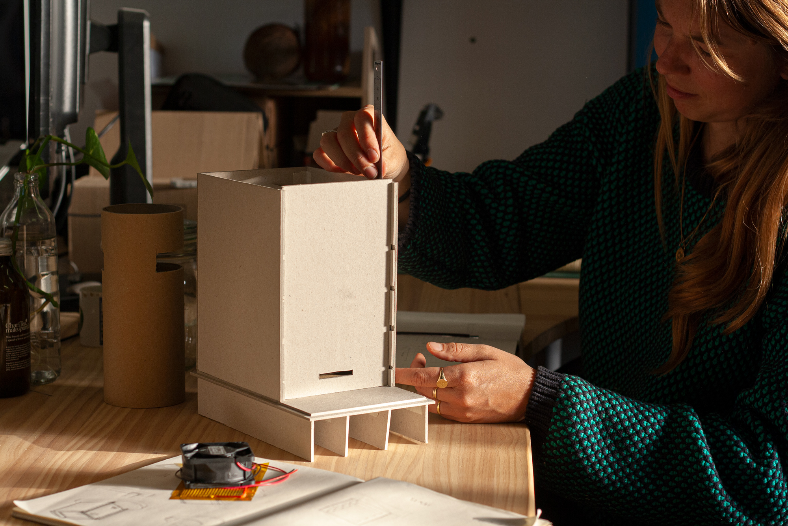

Design process. Modelling what will be the Domingo Fermenter Mini. A version of our fermenter that we imagine in everyone's kitchen, to start fermenting tempeh, a natural source of plant protein, but also koji, the base for miso, shōyu, amazake.

