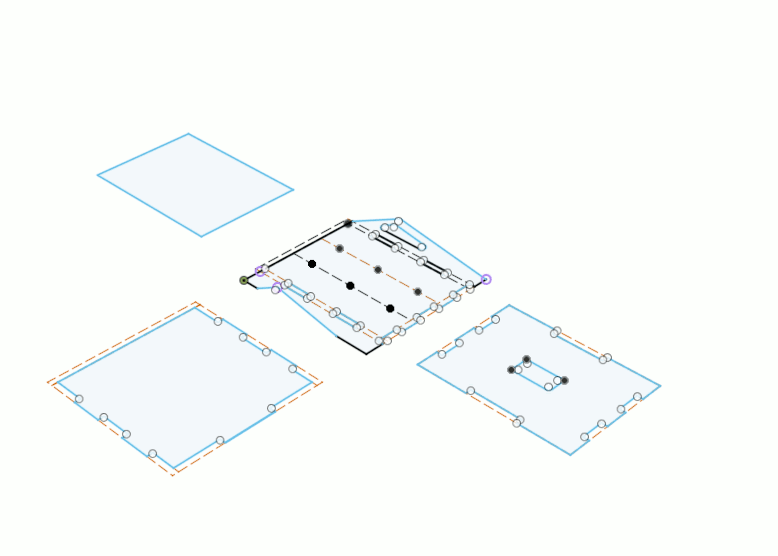
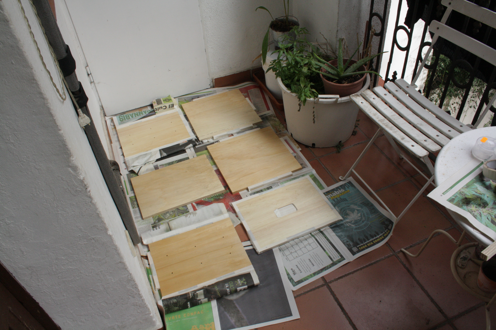

There are several known ways to build an incubation cabinet: you can use a decommissioned refrigerator, a speed rack with a vinyl cover, styrofoam coolers, or wooden boxes. The two basic criteria for a good container are insulation and water resistance.

We first experimented with a styrofoam cooler box that we picked up (for free) from a fish shop. It worked well but we wanted to design something more personal, with the size we want and the shape we like, using a parametric software to allow anyone to easily open the file and modify the parameters.

For this version, we choose to make a box out of plywood (15mm) for the following reasons:

- we could have access to the CNC milling machine of Fablab Barcelona to manufacture it
- we could then design it from scratch
- by using a parametric software
- and easily distribute the files with few instructions  

We came with a simple and playful design which assembles by itself with T-bones joints (no glue, no screws), except for the front door which uses 3D printed hinges and a 3D printed lock.

I just sprayed varnish on the inside of the cabinet to make it easier to clean. So far, the cabinet is working like that but we observed that it took it more time to warm up till 30°C than with the styrofoam cooler. Which is normal because the cabinet's volume is larger, but we want to optimise it by insulating it from the inside. One of the idea would be to grow a thin layer of mycelium on its inner sides :-P, but we first gonna try with some ready to use natural insulation such as hemp or so.

