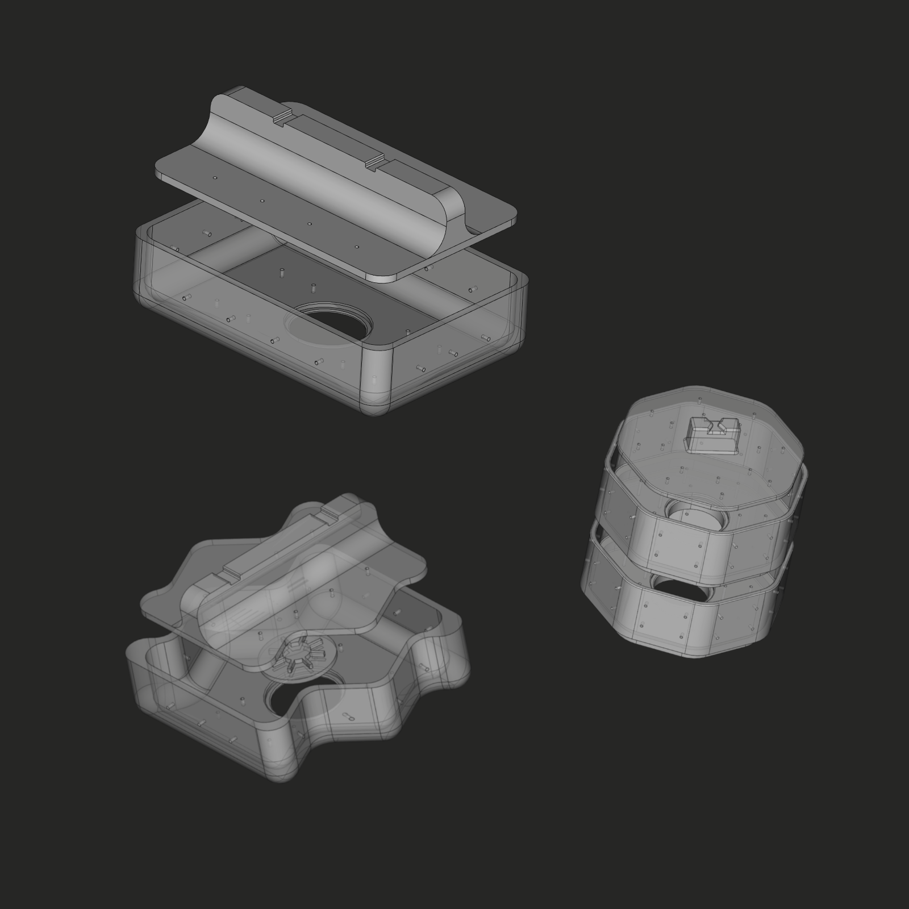
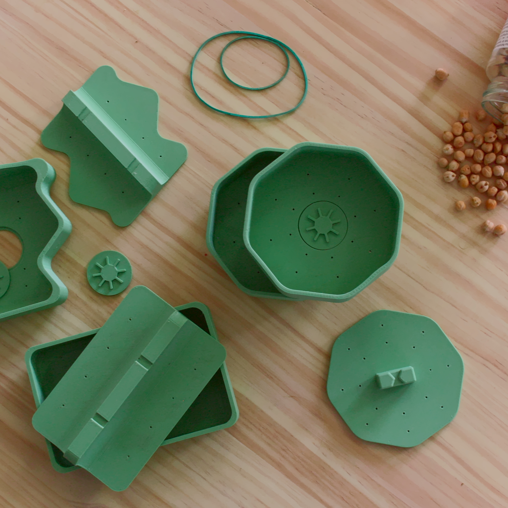

# The Design

The design is pretty simple, but smooth and balanced. It consists of a ~120x80x30 mm container (3mm of thickness) with a lid. There are small perforations all around the container and on the lid to allow the tempeh to breath during the fermentation process. The lid has notches to hold two rubber bands to keep the soybeans compacted inside. And the bottom part of container has a removable coin to easily remove the tempeh from the mould after incubation.

With these constraints put together, several forms can follow. We have for now, a rectangle, a zigzag and a stackable round mould.

We use [FreeCAD](https://www.freecadweb.org/), an open-source parametric 3D modeler that you can download for free, to design our mould. Parametric modeling allows you to easily modify our design by going back into our spreadsheet and change the values in milimeters.

# The Fabrication

Our moulds are 3D printed with our [Prusa Mini](https://www.prusa3d.com/original-prusa-mini/) with PETG filament from [Prusament](https://shop.prusa3d.com/fr/prusament/1300-prusament-petg-pistachio-green-1kg.html)

We use PETG filament because the material is food grade but we realised that printing this material in 3D does not guarantee a food grade object because the hollows between the printing layers become a nest of bacteria that is difficult to clean.

Either a top coat would therefore be necessary or just ensure that the part is thoroughly cleaned, sanitized and verified clean prior to use. Before using our moulds, we first wash them with dish soap and dry them with a towel, then disinfect them with 70% alcohol and a cotton cloth.

# Distributed Design and Decentralised Fabrication

We want our moulds open-source and easy to anyone to replicate and we allow peer reviews to make sure everyone agrees on how things are done.

We therefore use the principles of distributed design and decentralized manufacturing for the tools we make. Which means that you can download our models, review and adapt them, and produce them yourself.

## Here are the sources of:

- the rectangle tempeh mould V1 (stl file and freeCAD file)
- the zigzag tempeh mould v1 (stl file and freeCAD file)
- the round stackable tempeh mould v1 (stl and freeCAD file)

available on [github](https://github.com/domingoclub/tempeh-moulds) and [wikifactory](https://wikifactory.com/@domingoclub/tempeh-molds)

## Here are some instructions you have to pay attention if you wish to 3D print our mould yourself:

### Material:

- Potentially safe filaments might contain unsafe pigments, check it twice with your supplier.
- You should make the surface as smooth as possible. Unfortunately, this cannot be done properly with chemical smoothing: ASA and ABS are mostly unsafe materials and PLA/PETG can be smoothed only with dangerous chemicals.
- So 3D print the moulds at the lowest feasible layer height.

### 3D printer:

- Use a stainless steel nozzle.
- Keep your printer and printing environment as clean as possible.
- If, like us, you have a PTFE tube in the extruder, the temperatures do not exceed 240°C.

Please, find more details through those guides from [Prusa](https://blog.prusaprinters.org/how-to-make-food-grade-3d-printed-models_40666/) and [Formlabs](https://formlabs.com/blog/guide-to-food-safe-3d-printing/)
