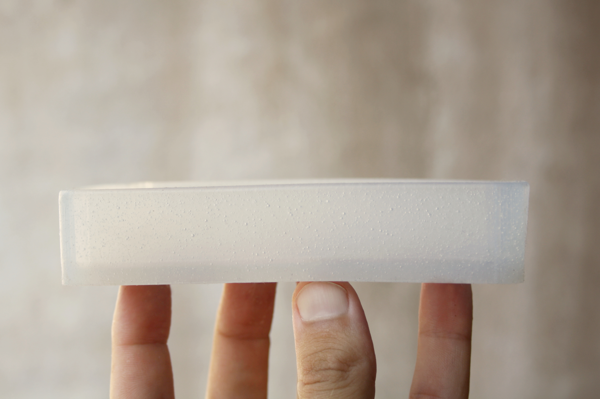

First attempt at making a silicone mould for tempeh production. We used a mini-milling machine to mill our design into a block of wax, then poured food grade silicone into it to produce the desired silicone tempeh mould.

# Good points
- The result is very promising, we really like it!
- Silicone is easy to clean and safe in a kitchen
- The *moulding and casting* technique can easily be optimised for higher production.

# Bad points
- The container is maybe a bit too flexible
- The container mould was difficult to peel off, we need to find a trick in our design to make this step easier
- The overall result is a bit sticky, maybe the mixing wasn't done properly (ratio 1/1)

<video><source src="IMG_8257.mp4"></video>

# Fabrication process

- Milling machine: [Roland SRM-20](https://www.rolanddga.com/products/3d/srm-20-small-milling-machine)
- Wax block: Ferris File-A-Wax
- Food grade silicon: [Feroca Easyl 940-FDA](https://www.feroca.com/en/platinum-addition/718-easyl-940-fda-food-silicone.html?search_query=food&results=11#/capacity_kits-kit_of_2_kg_)

## Pouring silicon

<video><source src="IMG_8211.mp4"></video>

