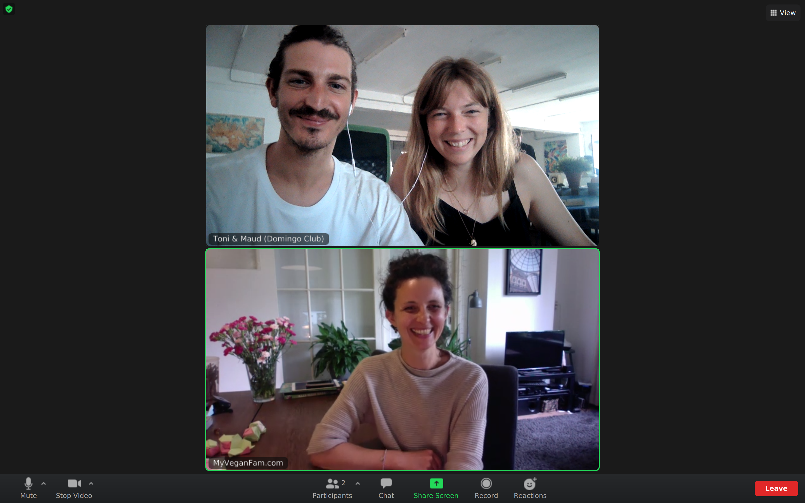
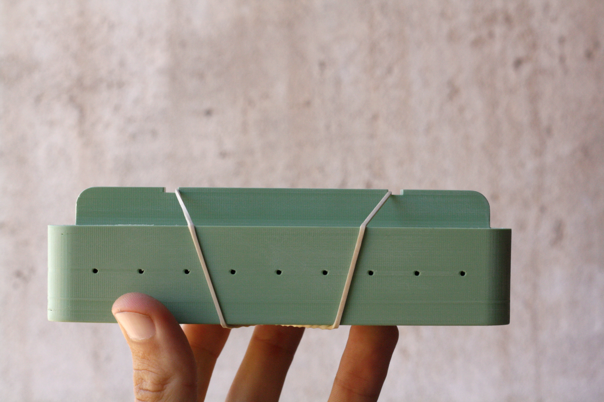

In the context of the [Hyper Global / Hyper Local exchange programme](https://makersxchange.eu/), we teamed up with Valentina from [My Vegan Fam](https://www.myveganfam.com/) to improve our [tempeh moulds](tempeh-moulds.html).

!!! notes "Let us introduce Valentina"
    Valentina is a professional tempeh maker based in Amsterdam. She has a burning passion for tempeh and that pushes her to get out and spread the love for this fantastic food. She is the one who gave us her tempeh recipe when we were in Amsterdam two years ago.

She tested our moulds and give us feedback, we then co-designed the next version and finally, we supported her to 3D print the new version in a local makerspace in order to test the distributed design and decentralised fabrication side of the project.

# What's new?

- We have decreased the thickness to 2mm.
- We have increased the number of holes and their diameter.
- We have abandoned the stackable version because it causes the tempeh to overheat during incubation.
- We also have designed a larger model (10x15).
- We have explored other materialities (silicon) that has [its own article](silicon-moulds-01.html).

# Here are the sources

- the 8x12 rectangle tempeh mould V02 (STL and Fusion360 file)
- the 10x15 rectangle tempeh mould V02 (STL and Fusion360 file)

Available on [github](https://github.com/domingoclub/tempeh-moulds-v-02)

# How to fabricate the moulds?

Read [our article](fabrication.html) to know how to 3D-print your own tempeh moulds.

