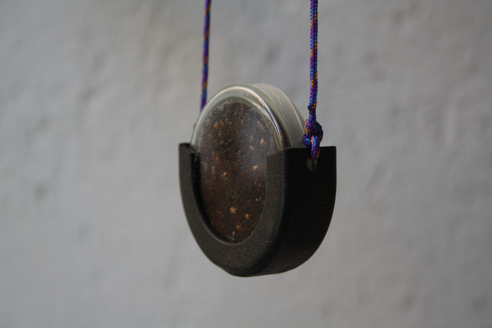
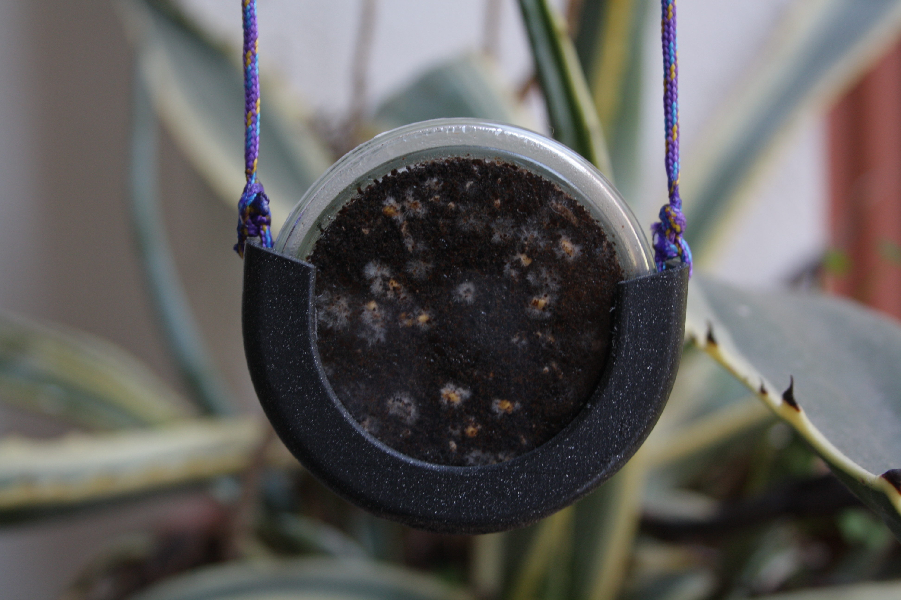

Wear this necklace for 3 weeks and incubate edible mushrooms with the heat of your body. If you take well care of your micro pet, you may harvest some!

This incubator necklace is a playful invitation to observe and understand the collaboration with natural processes. The glass petri dish contains fungus spores and those spores need constant humidity and temperature to develop. So if you wear the necklace for 3 weeks in a row, the roots of the mushrooms will grow and when the necklace has turned white, mini edible mushrooms will grow in the bright spot where you will have left the necklace.

# Fabrication

For this prototype version, we 3D printed a Galaxy Black PLA holder for the 60x12mm glass petri dish.

The source file is available on [GitHub](https://github.com/domingoclub/incubator-necklace)

Then, we inoculated mushroom spawn/mycelium into fresh coffee grounds and sealed the petri dish with a strip of paraffin film.

# Instructions

- Wear the necklace against your skin, under your t-shirt.
- When the necklace is not being worn, it is recommended to store it in a dark place with a room temperature between 20°C and 27°C.
- When the roots of the mushroom have fully developed and the content of glass petri dish has turned white (within 20-30 days), you can take the glass petri dish out of the necklace, remove the strip of paraffin film from around it and place the petri dish in a bright place out of direct sunlight. The petri dish should remain closed with the larger plate underneath. The mushrooms should appear within a few days.

