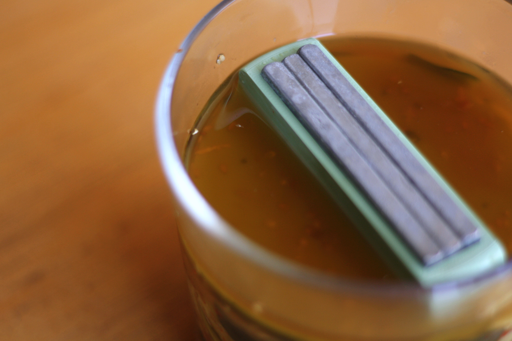
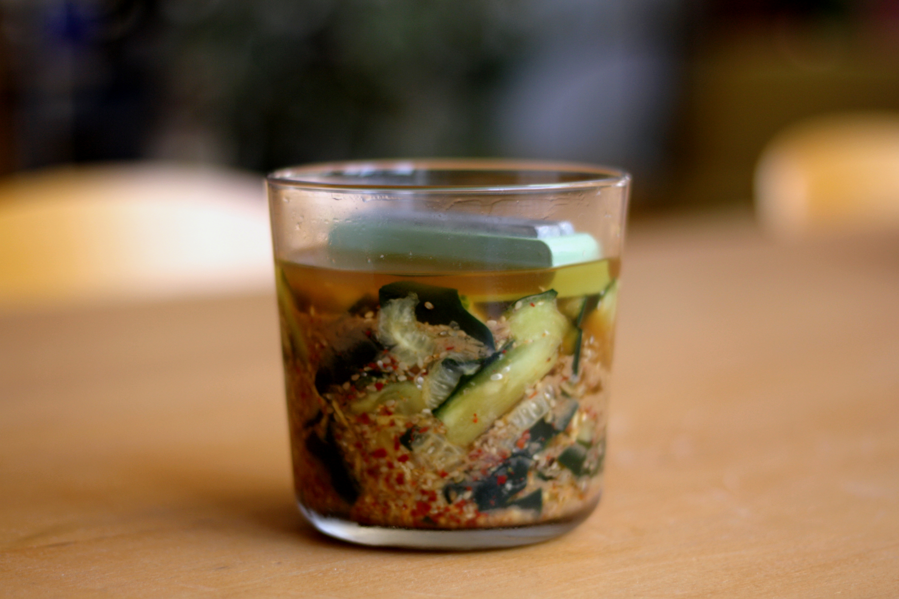
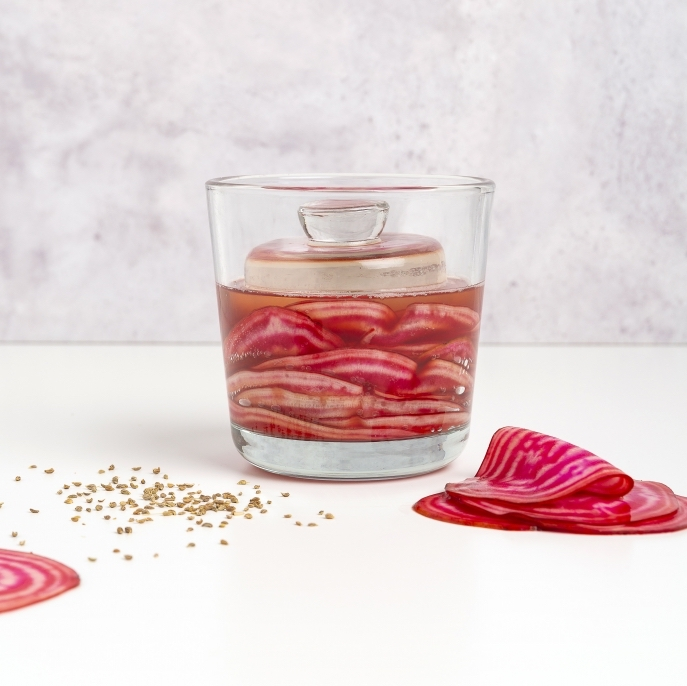
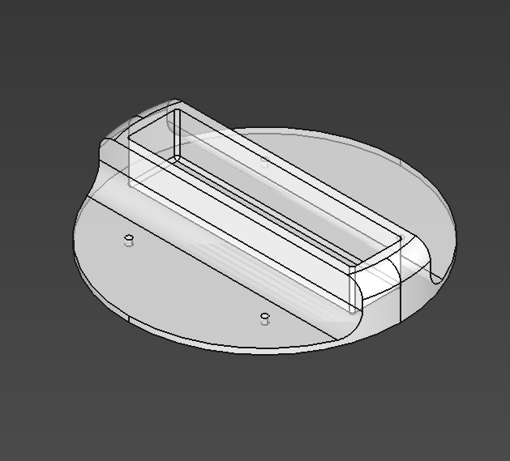

Fermentation doesn't require any special tools. But there are tools that can make your fermentations more successful. For instance, a press lid.

Basically, it is just a lid on which you put pressure.

You may have seen different kind of pickle press, from the very traditional japanese one made with a wooden barrel, a board and stones (called tsukémono ishi) to a plastic press with a screw thread system or a glass press.

But the thing is, we all have containers at home in which we can ferment our vegetables. Any plate or smaller container can do the job of the press-lid. However, as your fermenting practice grows and diversifies, it is nice to have the right tools.

So we used our 3D printer to make us custom lids that match the containers we have at home.

## The design

It is a 2 mm thick lid 3D-printed in PETG. There are small perforationson the lid to allow the liquid to comes up during the fermentation process, so that the lid stay in contact with the veggies.

The special feature of this lid is that the handle is hollow so that it can hold weight. You can insert whatever heavy you find like stones, glass marbles, or like us a solid stainless steel stem.

Because we designed this lid in a parametric software, its size can be adapted to any container!

## What the press lid for?

The pressure on salty food accelerates the chemical and physical transformation process of vegetables.
What this does is collapse the cell walls of the vegetable, releasing the moisture and concentrating the flavor.
So adding some pressure to the veggies helps the salt do its work.
