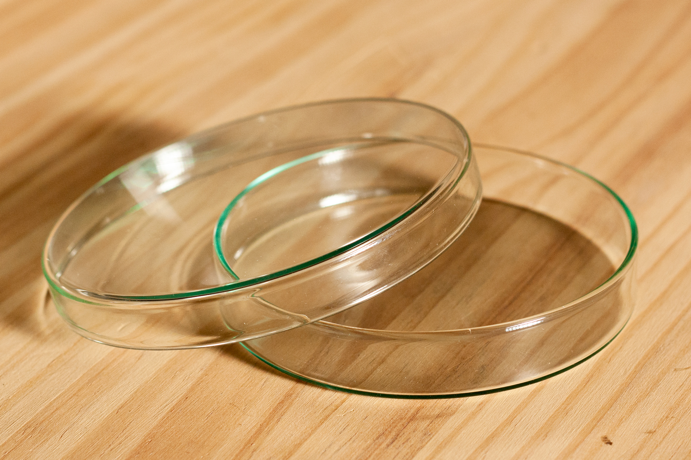
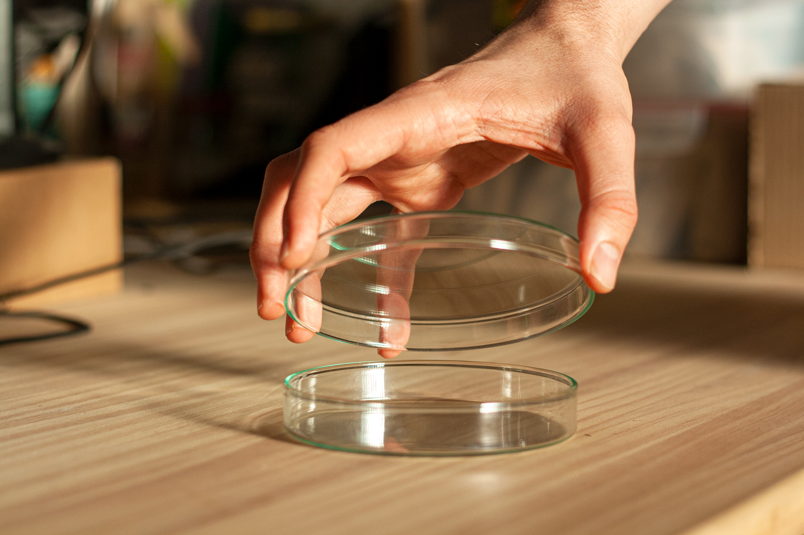

  
€4,00 EUR (tax included)

  

    
Glass Petri dish with lid, 120x20 mm.

    
These Petri dishes work wonderfully well for making tempeh. The glass is easy to clean, does not retain any bacteria and has good heat dissipation. The double layer system allows for ideal breathing so that the mycelium can develop optimally. We highly recommend them.

  

  

  

    Worldwide shipping or pick-up at Carrer de Pere IV 29 08018 Barcelona. 
  

