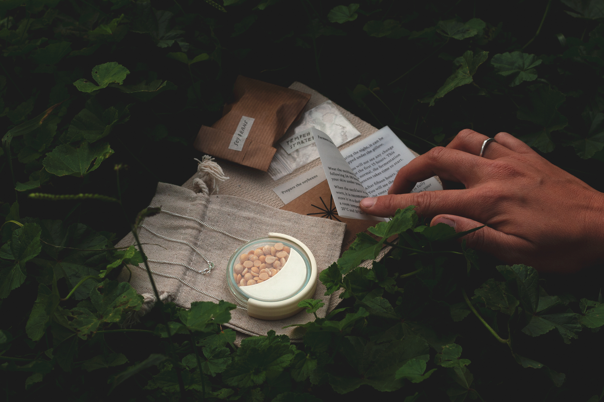

  
€65,00 EUR (tax included)

  

  Wear this necklace for 24-30 hours to ferment your own plant-based protein with the heat of your body. Handmade in Barcelona.
  

  

  

    Worldwide shipping or pick-up at Carrer de Pere IV 29 08018 Barcelona. Made to order. Please allow 2-3 weeks for production.
  

## The Domingo Necklace is made of

- a 1.5 mm wide fairtrade 925 sterling silver curb chain with a spring ring clasp
- a lightweight petri dish holder designed and 3D printed by us in bioplastic (PLA)
- a 60 mm diameter glass petri dish with the Domingo Club logo engraved on the back
- a moon-shaped measuring tool designed and 3D printed by us in bioplastic (PLA)
- organic split soybeans grown in Italy (non-GMO and no chemicals used during any stage of production)

## The necklace comes with

- [instructions](domingo-necklace-v1-0.html) to make your own tempeh with the Domingo Necklace
- soybeans and tempeh starter to create four tempehs with the Domingo Necklace

## Color

- Galaxy Black or Vanilla White

## Size

- One Size (71 cm neck size)

