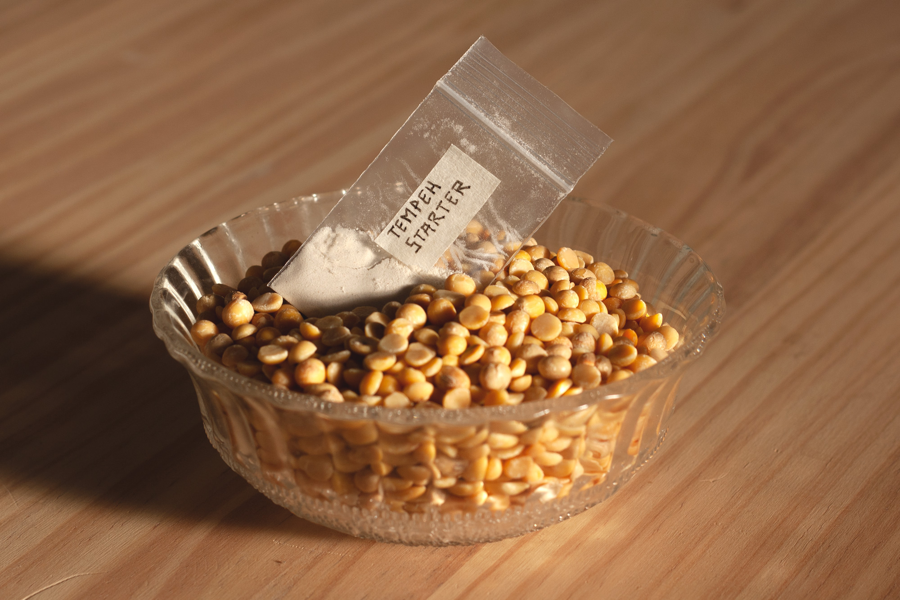

  
€4,00 EUR (tax included)

  

  Refill of organic split soybeans and tempeh starter (rhizopus spores). With this refill you will have enough ingredients to grow 30 small tempeh using the Domingo necklace.
  

  

  

    Worldwide shipping or pick-up at Carrer de Pere IV 29 08018 Barcelona. 
  

This kit is made to be used with the [Domingo necklace](domingo-necklace.html).

## This kit contains

- 250 grams of organic split soybeans grown in Italy (non-GMO and no chemicals used at any stage of production)
- 2 grams of tempeh starter grown in Belgium from non-GMO ingredients

It's important to know where our food comes from.